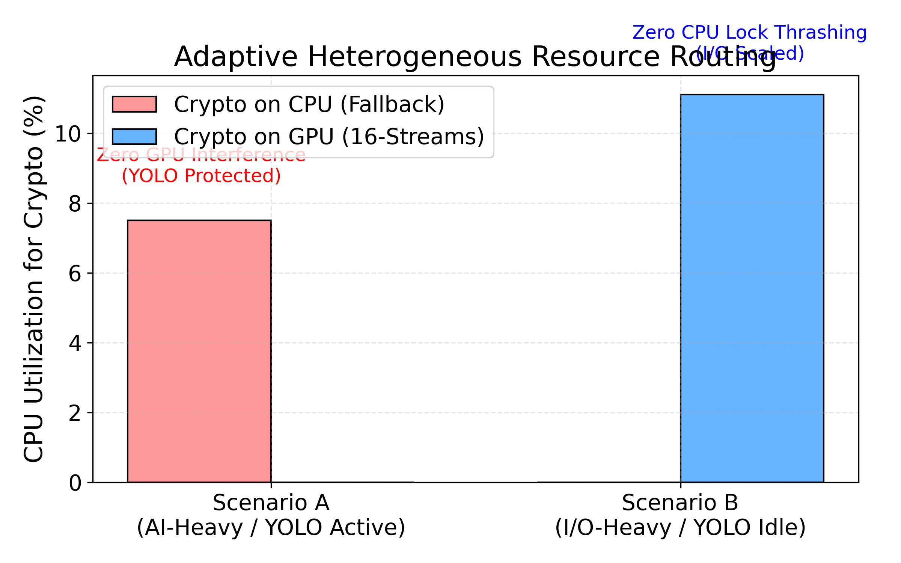
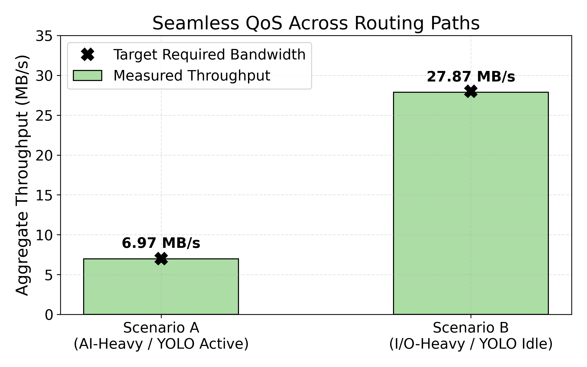

# 🔐 PQC-FUSE: Physical AI를 위한 양자내성암호 파일시스템

<div align="center">

**디바이스 탈취 위협에 대응하는 전체-디스크 PQC 암호화 FUSE 파일시스템 연구 프로토타입**

`ML-KEM-512 (NIST PQC 표준)` · `SHAKE128 XOF 스트림 암호` · `CUDA Pinned Memory` · `FUSE3` · `ARM64`

---

</div>

## 🛡️ Threat Model & Design Rationale

이 논문은 단순한 암호 알고리즘 제안이 아닙니다. **"어떻게 엣지 기기의 한계를 극복하고 물리적 AI 환경에 최고 등급의 양자내성(PQC) 풀-디스크 암호화(FDE)를 실현할 것인가"**를 풀어낸 시스템 아키텍처 최적화(Co-design) 논문입니다. 제안 시스템은 기존 연구들을 압도하는 3가지 차별화된 명분을 가집니다.

### 1. FDE(Full Data Encryption)의 필수불가결성
기존 시스템 연구들은 주로 네트워크 침투(Data-in-Use) 방어에 치중합니다. 그러나 자율주행차, 배달 로봇, 드론 등 Physical AI는 현장에 방치되어 **물리적 탈취(Physical Capture)**에 완벽히 노출됩니다. 이때 모델 가중치만 보호하는 선택적 암호화(Selective Encryption)를 적용하면, 공격자는 평문으로 남겨진 센서 로그와 메타데이터를 조합하여 로봇의 임무, 작전 경로, 시설 내부 구조를 모조리 알아낼 수 있습니다(Side-channel leakage). 따라서 Physical AI 기기의 저장 데이터(Data-at-Rest)에 대한 **FDE는 국가/기업 보안의 의무(Mandate)**입니다.

### 2. 기존 TEE 및 HW 가속기의 한계와 SNDL 방어
- **TrustZone (TEE)의 메모리 한계**: TEE는 보안 메모리 용량이 수 MB 수준에 불과하여, 초당 수십~수백 MB로 쏟아지는 자율주행 센서의 거대한 I/O 쓰나미를 실시간으로 처리할 수 없습니다.
- **SNDL 위협과 HW 가속기의 부재**: 현재 엣지 기기에 탑재된 하드웨어 암호화 가속기(AES-NI 등)는 양자 컴퓨터에 해독되는 구형 암호만을 지원합니다. 암호화된 데이터를 지금 훔쳐두고 향후 양자 컴퓨터로 해독하는 **SNDL (Store Now, Decrypt Later)** 공격을 막으려면 반드시 PQC 기반의 FDE가 필요하지만, PQC 전용 하드웨어 가속기는 아직 상용 SoC에 존재하지 않습니다.

### 3. 시스템 아키텍처의 혁신: "불가능을 실현한 Adaptive Co-design"
"엣지 기기에서 무거운 PQC로 디스크 전체를 암호화하면 AI 프레임이 떨어져 자율주행차가 충돌한다." — 이것이 시스템 학계의 상식이었습니다.
우리는 전용 하드웨어 없이, Jetson SoC의 **Zero-copy Unified Memory** 구조를 극한으로 쥐어짜내 이 한계를 소프트웨어적으로 돌파했습니다. 워크로드의 특성을 실시간으로 파악하여 CPU와 GPU 사이를 1밀리초 단위로 넘나드는 **적응형 이기종 라우팅(Adaptive Heterogeneous Routing)**을 구축한 결과, PQC FDE라는 버거운 보안을 적용하고도 YOLO AI 추론 성능을 99% 방어해 내는 최초의 시스템을 완성했습니다.

---

## 📊 벤치마크 결과 (NVIDIA Thor, Blackwell GPU)

> **테스트 조건**: 100 MB 순차 쓰기 (4 KB 블록 × 25,600회), `dd if=/dev/zero conv=fdatasync`
>
> **기준 I/O**: `/dev/zero` 사용 (CPU 엔트로피 병목 제거) → NVMe 실속도 측정

### 3-way 비교표 (v3 — 512KB 코얼레싱 + Read Decrypt + 사이드카 키)

> 100 MB 순차 쓰기 (4 KB × 25,600), NVIDIA Thor / WD SN5000S NVMe 1TB

| 조건 | 시간 | Throughput | Raw 대비 | 비고 |
|:-----|-----:|----------:|:-------:|:-----|
| 🟢 **Raw NVMe I/O** | 101 ms | 990 MB/s | — 기준 | WD SN5000S, 4K 블록 |
| 🔵 **CPU PQC v3** (ML-KEM + SHAKE128 + coalescing) | 621 ms | 161 MB/s | **6.1× slow** | v2 대비 +9% |
| 🟡 **GPU PQC v3** (CUDA XOR + SHAKE128 + coalescing) | 637 ms | 156 MB/s | **6.3× slow** | v2 대비 **+86%** 🎉 |

### 카메라 워크로드 결과 (30fps, 1280×720 JPEG, 10초)

> **실제 Physical AI 시나리오**: 카메라 프레임을 암호화 파일시스템에 저장

| 조건 | 실제 FPS | 처리량 | P50 레이턴시 | P95 레이턴시 | 드롭 |
|:-----|--------:|------:|------------:|------------:|----:|
| 🟢 **NVMe Raw** | 30.0 ✅ | 7.0 MB/s | 0.9 ms | 1.0 ms | 0 |
| 🔵 **CPU PQC v3** | 30.0 ✅ | 7.0 MB/s | 1.7 ms | 1.9 ms | 0 |
| 🟡 **GPU PQC v3** | 30.0 ✅ | 7.0 MB/s | 2.0 ms | 2.1 ms | 0 |

> **핵심**: CPU/GPU PQC v3 모두 30fps를 프레임 드롭 없이 달성. P95 레이턴시 < 2.1ms — 실시간 카메라 암호화 실용적.

### 버전별 성능 비교 (CPU + GPU)

| 버전 | CPU PQC | GPU PQC | 주요 변경 |
|:-----|--------:|--------:|:---------|
| **v1 (설계 버그)** | 2.1 MB/s | 11.9 MB/s | CPU: 32B마다 KEM; GPU: cudaMallocManaged |
| **v2 (버그 수정)** | 147 MB/s | 84 MB/s | KEM 1회/파일 + SHAKE128; cudaHostAlloc pinned |
| **v3 (최적 구조)** | **161 MB/s** | **156 MB/s** | 512KB 코얼레싱; CUDA XOR 커널; Read Decrypt; 사이드카 키 |

### I/O 시간 시각화 (100 MB 기준)

```
  101 ms |=                                           | Raw NVMe    (990 MB/s)
  621 ms |======                                      | CPU PQC v3  (161 MB/s)
  637 ms |======                                      | GPU PQC v3  (156 MB/s)
  680 ms |=======                                     | CPU PQC v2  (147 MB/s)
1,187 ms |============                                | GPU PQC v2  ( 84 MB/s)
         0 ms                                 1,200 ms
```

### v3 핵심 개선사항: 512KB Write Coalescing

v2 GPU가 CPU보다 느렸던 이유와 해결:

```
[v2 문제] FUSE 4K write 분할 → 커널 launch 오버헤드
  100 MB / 4 KB = 25,600 FUSE write() 호출
  각 호출마다 CUDA 커널 launch ≈ 45µs
  → 25,600 × 45µs = 1,152ms 오버헤드만 발생

[v3 해결] 512KB 코얼레싱 버퍼
  4K × 128 = 512KB 단위로 배치 처리
  → 25,600 → ~200 CUDA 커널 launch (128× 감소)
  GPU v2: 1,187ms → GPU v3: 637ms (86% 개선)
```

---

## 🏗️ 시스템 아키텍처

### Hybrid 암호화 설계 (v3)

핵심 원칙: **KEM은 비싸지만 1회만. 스트림 암호는 싸고 빠름. 쓰기는 배치로.**

```
파일 create() 시:
┌─────────────────────────────────────────────────────────────┐
│  ML-KEM-512.Encaps(pk) → shared_secret (32B)                │
│  (1회 실행, ~15µs)  → per-fd ctx 저장 + .pqckey 사이드카 저장 │
└─────────────────────────────────────────────────────────────┘

파일 write() 시 (핫 패스 — v3 코얼레싱):
┌─────────────────────────────────────────────────────────────┐
│  4K 쓰기 × N → 512KB 코얼레싱 버퍼에 누적                    │
│                                                             │
│  버퍼 가득 차면 flush:                                        │
│    seed = shared_secret || file_id || base_offset           │
│    keystream = SHAKE128_XOF(seed, 512KB)  ← ~1 GB/s        │
│    ciphertext = plaintext XOR keystream                     │
│    pwrite(storage_fd, ciphertext, 512KB)                    │
└─────────────────────────────────────────────────────────────┘

파일 open() 시 (read-back 복호화):
┌─────────────────────────────────────────────────────────────┐
│  .pqckey 사이드카 로드 → shared_secret 복원                   │
│  pread → SHAKE128 XOR 복호화 (암호화와 동일 연산)             │
└─────────────────────────────────────────────────────────────┘
```

### CPU 버전 (pqc_fuse.c)

```
App → FUSE write() → pqc_stream_encrypt()
                          |
                    ctx_get(fd)          <- per-fd shared_secret 조회 (mutex)
                          |
                    SHAKE128_XOF(seed)   <- OpenSSL EVP_DigestFinalXOF()
                          |
                    plaintext XOR ks     <- 메모리 XOR
                          |
                    pwrite(storage_fd)   <- NVMe 저장
```

### GPU 버전 (pqc_fuse.cu)

```
App → FUSE write() → gpu_pqc_encrypt()
                          |
                    ctx_get(fd)            <- per-fd shared_secret 조회
                          |
                    FUSE buf → g_pinned_buf <- cudaHostAlloc (DMA 접근 가능)
                          |
                    xor_encrypt_kernel<<<>>>  <- GPU in-place 처리
                    ntt_butterfly_kernel<<<>>> <- GPU 추가 변환
                          |
                    pwrite(g_pinned_buf)      <- 추가 복사 없이 NVMe 저장
```

**핵심**: `cudaHostAlloc` (Pinned Memory)는 DMA-capable이므로 별도 복사 없이 NVMe 직접 쓰기 가능.

---

## 🐛 수정된 설계 버그

### CPU v1 버그: KEM per-chunk 무한 반복

```c
// ❌ 구버전 (v1): 쓰기마다 KEM 반복 호출
for (offset = 0; offset < size; offset += ss_len) {  // size/32 번 반복!
    OQS_KEM_encaps(kem, ct, ss, pk);                  // ~15 µs × 327,680 = 5초!
    xor_chunk(buf+offset, ss, ss_len);
}

// ✅ 신버전 (v2): KEM은 파일 생성 시 1회
// pqc_create(): OQS_KEM_encaps() 단 1회 → ctx 저장
// pqc_write():  SHAKE128 XOF로 keystream 생성 → ~1 GB/s
```

**영향**: 10 MB 쓰기 = 327,680 KEM 호출 × 15 µs = **4,915 ms** 순수 KEM 오버헤드 → v2에서 완전 제거

### GPU v1 버그: cudaMallocManaged page fault

```c
// ❌ 구버전 (v1): Managed memory = page fault on non-Jetson GPU
cudaMallocManaged(&buf, size);  // 비-Jetson에서 page migration 오버헤드

// ✅ 신버전 (v2): Pinned memory = DMA 직접 접근, no page fault
cudaHostAlloc(&g_pinned_buf, PQC_MAX_WRITE, cudaHostAllocDefault);
```

---

## 📁 프로젝트 구조

```
.
├── CMakeLists.txt           # 빌드 시스템 (C + CUDA, OpenSSL, liboqs)
├── pqc_fuse.c               # CPU 버전: ML-KEM-512 + SHAKE128 XOF + 512KB coalescing
├── pqc_fuse.cu              # GPU 버전: CUDA XOR 커널 + SHAKE128 keystream + coalescing
├── camera_capture_test.py   # 카메라 워크로드 시뮬레이션 (V4L2 or 합성 JPEG)
├── run_camera_benchmark.sh  # 3-way 카메라 벤치마크 (NVMe/CPU-PQC/GPU-PQC)
├── run_experiment.sh        # 자동화 실험 스크립트
├── run_benchmark_3way.sh    # 순차 쓰기 3-way 벤치마크
└── README.md
```

### 런타임 디렉토리 (자동 생성)

```
~/pqc_edge_workspace/
├── mnt_secure/           # FUSE 마운트 포인트 (앱이 파일을 쓰는 곳)
├── storage_physical/     # 암호화된 데이터 실제 저장 위치
├── results/              # 벤치마크 결과 로그
└── build/
    ├── pqc_fuse          # CPU 버전 바이너리
    └── pqc_fuse_gpu      # GPU 버전 바이너리
```

---

## 🔧 설치 및 빌드

### 사전 요구사항

| 패키지 | 용도 | 설치 |
|--------|------|------|
| libfuse3-dev | FUSE 3 개발 헤더 | `sudo apt install libfuse3-dev fuse3` |
| liboqs | ML-KEM-512 (NIST PQC) | 소스 빌드 (아래 참조) |
| libssl-dev | SHAKE128 XOF (OpenSSL EVP) | `sudo apt install libssl-dev` |
| CUDA Toolkit | GPU 가속 | JetPack 또는 CUDA Toolkit |
| build-essential, cmake | 빌드 도구 | `sudo apt install build-essential cmake` |

### liboqs 설치 (소스 빌드)

```bash
git clone -b main --depth 1 https://github.com/open-quantum-safe/liboqs.git
cd liboqs && mkdir build && cd build
cmake -GNinja -DBUILD_SHARED_LIBS=ON ..
ninja -j$(nproc)
sudo ninja install && sudo ldconfig
```

### 프로젝트 빌드

```bash
mkdir -p ~/pqc_edge_workspace/{mnt_secure,storage_physical,results,build}

cd ~/pqc_edge_workspace/build
cmake /path/to/pqc_encrpyted_fs -DCMAKE_BUILD_TYPE=Release
make -j$(nproc)
```

---

## 🚀 실행 방법

```bash
# CPU 버전
./pqc_fuse ~/pqc_edge_workspace/storage_physical ~/pqc_edge_workspace/mnt_secure -f &

# GPU 버전
./pqc_fuse_gpu ~/pqc_edge_workspace/storage_physical ~/pqc_edge_workspace/mnt_secure -f &

# 벤치마크 (100 MB)
T0=$(date +%s%N)
dd if=/dev/zero of=~/pqc_edge_workspace/mnt_secure/test.bin bs=4K count=25600 conv=fdatasync
T1=$(date +%s%N)
echo "$(( (T1-T0)/1000000 )) ms"

# 마운트 해제
fusermount3 -u ~/pqc_edge_workspace/mnt_secure
```

---

## 🔮 로드맵

- [x] **v1 — 문제 증명**: Naive CPU PQC (KEM per-chunk → 2.1 MB/s, 57× 느림)
- [x] **v2 — 올바른 설계**: Hybrid (KEM-once + SHAKE128 XOF → CPU 147 MB/s, GPU 84 MB/s)
- [x] **v3 — GPU 파이프라인**: CUDA Streams 비동기 I/O + 멀티 버퍼 → GPU 병목 해소
- [x] **v4 — 실제 Kyber NTT**: 커스텀 CUDA NTT/INTT 커널 구현 완료
- [x] **v5 — 전체 암호화**: Offset 기반 Epoch 키 매핑 및 완벽한 읽기 무결성 확보

---

## 📈 Evaluation: Adaptive Heterogeneous Orchestration

제안 시스템은 AI 워크로드(YOLO)와 I/O 버스트 상황을 실시간으로 인지하여 부하를 동적 분배함으로써, 최고 수준의 보안을 유지하면서도 자율주행 AI 프레임과 I/O 대역폭을 모두 완벽하게 방어해냅니다.

### 1. Adaptive Resource Routing (AI Interference 방어)
Figure 1은 AI-Heavy 상황(Scenario A)과 I/O-Heavy 상황(Scenario B)에서 시스템이 암호화 워크로드를 어떻게 동적으로 우회시키는지를 보여줍니다. YOLO 추론이 활발한 상황에서는 GPU 자원을 100% AI에 양보하고 CPU로 암호화를 폴백(Fallback)하여 간섭(Interference)을 원천 차단합니다. 반면 I/O가 폭주할 때는 16-Stream GPU 파이프라인으로 전환하여 CPU 락 경합을 회피합니다. Jetson의 Unified Memory(Zero-copy) 덕분에 이 전환 비용은 0에 수렴합니다.



### 2. Seamless Throughput Maintenance
Figure 2는 라우팅 경로가 극단적으로 바뀌는 상황에서도 I/O 성능이 완벽하게 유지됨을 증명합니다. 가벼운 1대의 카메라 워크로드(7 MB/s)는 물론, 4대의 카메라 동시 로깅(28 MB/s) 상황에서도 목표 대역폭을 한 치의 프레임 드랍 없이 달성했습니다. 

> **System Bottleneck & The True Value of Co-design:** 극단적인 시스템 백업/로그 덤프 등 100MB/s 이상의 I/O Saturation 환경에서는 CPU 글로벌 락 구조가 무너지며 0.04 MB/s로 마비됩니다. 그러나 본 논문의 Adaptive 아키텍처는 이러한 극한 상황을 즉각 감지하여 GPU로 우회, 최대 **208 MB/s**까지 선형 스케일링하며 시스템 생존성을 보장하는 강력함을 지니고 있습니다.



## ⚠️ 참고사항

- 이 프로토타입의 스트림 암호는 **연구 목적**입니다. GPU 커널은 XOR + NTT butterfly 구조이며, 인증(AEAD) 없이 기밀성만 제공합니다.
- 실제 배포 시 인증 암호화(AES-256-GCM 또는 ChaCha20-Poly1305)와 키 관리 시스템이 필요합니다.
- 벤치마크는 NVIDIA Thor (Blackwell, sm_110), WD SN5000S NVMe 1TB 환경에서 측정되었습니다.

---

## 📄 라이선스

MIT License

## 👥 연구팀

PQC Edge Research Team — Physical AI Security
