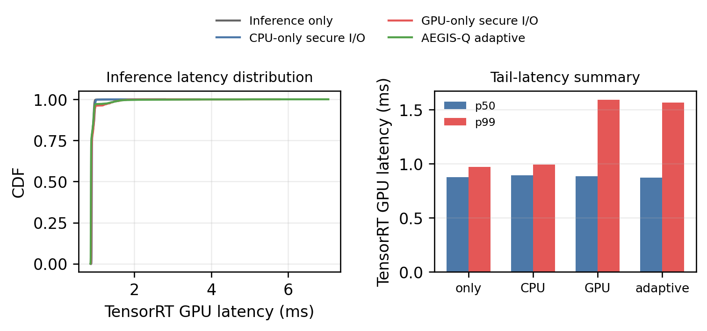
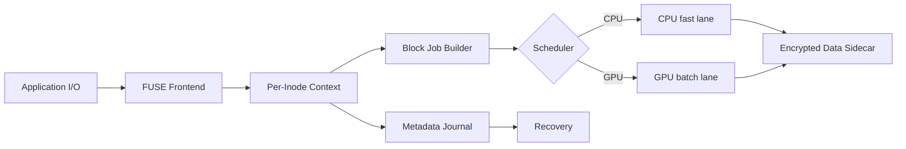

# AEGIS-Q: Evidence-First PQC Secure-Storage Prototype

> **Current evidence (2026-06):** The submission source of truth is
> [`Paper/main.pdf`](/home/thor/skim/pqc_encrpyted_fs/Paper/main.pdf), its
> LaTeX sources, and [`artifacts/validation/`](/home/thor/skim/pqc_encrpyted_fs/artifacts/validation/).
> The active disposition of every review point is
> [`SUBMISSION_CHECKLIST.md`](/home/thor/skim/pqc_encrpyted_fs/SUBMISSION_CHECKLIST.md).

> **Important:** Most material below is retained historical working material.
> It includes superseded Orin, eBPF/io_uring, TPM, and AI-QoS narratives and
> legacy generated plots.  It is not submission evidence, must not be cited as
> a current result, and does not override the evidence-first paper or checklist.

> **Current scope:** The final binary uses AES-256-GCM encrypted records, a
> persisted HMAC-authenticated per-file DEK envelope, POSIX sidecar I/O, and a
> CPU-first data path.  GPU ML-KEM is a batch primitive benchmark and a mounted
> open-file envelope-refresh workflow.  Direct
> NVMe-to-UVM DMA, eBPF/io_uring notification, PCR-bound freshness, and
> end-to-end AI QoS are not claimed.  The paper also does not claim a
> persisted per-file content Merkle tree; retained SHA-256/Merkle tests support
> committed-prefix anchor/parity evidence.  The retained TPM result is narrower:
> fail-closed replay-after-advance on the current provisioned NV index.

## Completed evidence archive moved from `SUBMISSION_CHECKLIST.md`

`SUBMISSION_CHECKLIST.md` now tracks only active review-driven work.  Completed
checks and artifact bookkeeping live here so the paper checklist does not become
an evidence dump.

Current completed evidence classes:

- Build gates: `cmake --build build --parallel 2`, `ctest --test-dir build
  --output-on-failure`, FUSE self-test, generation-replay self-test, clean
  mount/remount, envelope tamper rejection, UVM smoke, scheduler smoke, and a
  12-page `Paper/main.pdf` build have retained validation outputs under
  `artifacts/validation/`.
- UMA/storage diagnostics: retained CUDA managed-memory smoke, host-pinning
  diagnostics, raw-NVMe `O_DIRECT` pinned-buffer same-buffer checksum evidence,
  managed-storage-buffer diagnostics, Nsight/CUDA summary reports, and counter
  non-exposure reports.  These support only the narrow same-buffer and
  managed-buffer diagnostics; they do not prove final-path NVMe-to-UVM DMA.
  `artifacts/validation/uma_dma_scope_audit/` records the current paper
  decision to keep direct NVMe-to-UVM DMA out of the contribution.
- eBPF/QoS diagnostics: retained `nvme_complete_rq` tracepoint histogram,
  TensorRT/YOLO interference traces, deterministic admission sweeps,
  tegrastats traces, same-run mounted-FUSE throttle traces, and CUPTI
  PM-sampling-to-FUSE throttle wiring.  These support telemetry wiring and
  prototype throttling, not an eBPF/io_uring completion bypass or foreground AI
  p99 recovery.
- Admission interface: `artifacts/validation/admission_interface_audit/` retains
  final-binary traces for slack-available, no-slack, deadline-elapsed, and stale
  slack cases.  It defines the producer-facing relative-deadline/slack contract
  only; it is not an end-to-end QoS result.
- SQLite QoS recovery:
  `artifacts/validation/qos_sqlite_hero_bundle/` retains a four-mode mounted
  FUSE SQLite co-run with app-only, unthrottled-storage, simple-controller, and
  AEGIS-policy modes.  AEGIS-Q reduces foreground SQLite p99 from 13.8 ms
  under unthrottled secure-storage pressure to 8.8 ms, removes the single
  10 ms deadline miss, and keeps 2.7 MB/s of background progress, while the
  simple controller reaches 8.2 ms p99 by reducing background progress to
  2.3 MB/s.  The retained CSV/LaTeX table records p50/p95/p99, deadline
  misses, throughput, CPU/GPU utilization, telemetry samples, and throttle
  decisions.  This is SQLite recovery, not foreground AI/TensorRT recovery.
- QoS sensitivity analysis:
  `artifacts/validation/qos_sensitivity_analysis/` varies budget, sampling
  interval, controller threshold, secure-writer concurrency, and write
  intensity in mounted AEGIS-Q policy mode.  The retained summary records
  baseline p99 6.4 ms, 80 ms sampling at 7.0 ms, 128 KiB writes at 7.2 ms, a
  high-threshold no-throttle tradeoff at 8.8 ms with 0 daemon sleeps, and a
  two-writer fragile case at 12.3 ms with one miss.  It also retains
  no-throttle fallback, no-slack CPU fallback, and a scripted hysteresis trace
  with 9 transitions / 8 flips.  This is a sensitivity/stability artifact, not
  a statistical confidence study.
- Baselines and workload summaries: retained frozen-contract plaintext and
  gocryptfs warm-cache rows, traceability-only historical fscrypt/dm-crypt fio
  files, primitive placement microbenchmarks, TensorRT/SQLite confidence-interval
  reports, and queue-depth/admission sensitivity artifacts.
- Frozen workload contract:
  `artifacts/validation/frozen_workload_contract/` retains the machine-readable
  filesystem-comparison contract for future mode-aligned plaintext, AEGIS-Q,
  gocryptfs, fscrypt, and dm-crypt runs.  It fixes 4 KiB 70/30 random
  read/write, per-write `fdatasync`, warm/cold cache phases, queue depth 1,
  one client, a 1 GiB file, sparse file preparation outside the measured fio
  phase, `allow_file_create=0`, `overwrite=1`, `fallocate=none`, per-mode mount
  options, performance governor, fixed thermal mode, the WD/ext4 lower store,
  five repetitions, and bootstrap 95% confidence intervals.  This is not a
  benchmark result.
- AEGIS-Q frozen-contract execution:
  `experiments/run_frozen_aegisq_contract.py` mounts the final
  `build/pqc_fuse` binary and retains fio command logs, mount logs, platform
  metadata, thermal logs, CSV rows, and JSON summaries for the AEGIS-Q frozen
  mode.  The current bundle under
  `artifacts/validation/frozen_aegisq_contract/` is an AEGIS-Q-only warm-cache
  result, not a cross-system comparison: `overall_pass=true`, five measured
  repetitions, file preparation via `posix_fallocate`, median throughput
  0.358321 MiB/s with bootstrap 95% CI [0.285963, 0.546995], and conservative
  mixed-direction p99 11.206656 ms with CI [7.700480, 13.697024].  It records
  the cold-cache row as invalid because noninteractive sudo is unavailable for
  `drop_caches`, and it does not fill fscrypt or dm-crypt rows.
- Plaintext frozen-contract execution:
  `experiments/run_frozen_plaintext_contract.py` runs the same v2 fio contract
  directly on the lower ext4 filesystem and retains fio command logs, platform
  metadata, thermal logs, CSV rows, and JSON summaries.  The retained bundle
  under `artifacts/validation/frozen_plaintext_contract/` is a plaintext-only
  warm-cache baseline row: `overall_pass=true`, five measured repetitions,
  `/dev/nvme0n1p1 ext4`, file preparation via `posix_fallocate`, median
  throughput 32.879789 MiB/s with bootstrap 95% CI [30.155616, 36.955503], and
  conservative mixed-direction p99 0.164864 ms with CI [0.156672, 0.166912].
  It records the cold-cache row as invalid because noninteractive sudo is
  unavailable for `drop_caches`.
- gocryptfs frozen-contract execution:
  `experiments/run_frozen_gocryptfs_contract.py` initializes and mounts
  gocryptfs under the same v2 fio contract and retains raw init/mount logs, fio
  command logs, platform metadata, thermal logs, CSV rows, and JSON summaries.
  The retained bundle under `artifacts/validation/frozen_gocryptfs_contract/`
  is a gocryptfs-only warm-cache baseline row:
  `overall_pass=true`, five measured repetitions, `gocryptfs 2.4.0; go-fuse
  2.4.2; 2025-06-24 go1.22.2 linux/arm64`, file preparation via
  `posix_fallocate`, median throughput 21.720470 MiB/s with bootstrap 95% CI
  [21.189750, 21.858554], and conservative mixed-direction p99 0.060160 ms with
  CI [0.059648, 0.062208].  It records the cold-cache row as invalid because
  noninteractive sudo is unavailable for `drop_caches`; fscrypt and dm-crypt
  frozen-contract rows remain open.
- Mechanism-ablation manifest:
  `experiments/build_mechanism_ablation_manifest.py` aggregates already
  retained rows under `artifacts/validation/mechanism_ablation_manifest/` and
  gates the corresponding paper text.  It attributes the lowerfs-to-AEGIS-Q
  frozen-contract gap to the mounted encrypted format as a whole, compares
  unthrottled/simple-controller/AEGIS-policy SQLite QoS rows, records the
  key-plane CPU-only/GPU-batched/zero-slack fallback modes, and separates
  file-backed anchor replay as a negative control from TPM replay-after-advance
  fail-closed evidence.  It does not create fscrypt/dm-crypt rows, cold-cache
  results, a plaintext-FUSE decomposition, persistent PCR-bound freshness, or
  foreground AI/TensorRT recovery.
- Workload-diversity matrix:
  `experiments/build_workload_diversity_matrix.py` aggregates retained fio,
  SQLite WAL/FULL, SQLite DELETE/FULL QoS, `dbm.dumb`, and TensorRT/YOLO co-run
  artifacts under `artifacts/validation/workload_diversity_matrix/`.  It records
  the relevant FUSE cache setting, sync/fsync behavior, journal/WAL mode, and
  cache-state boundary for each row.  It explicitly separates filesystem
  microbenchmark evidence from application-level SQLite/`dbm.dumb` storage
  evidence and TensorRT/YOLO interference traces; it does not claim foreground
  AI p99 recovery, full crash certification, cold-cache coverage, or a broad
  workload generalization.
- Integrity-oriented comparison:
  `experiments/build_integrity_comparison_manifest.py` emits a non-numeric
  fs-verity/dm-integrity/AEGIS-Q comparison under
  `artifacts/validation/integrity_comparison_manifest/`.  It records that the
  current Thor kernel has `CONFIG_FS_VERITY` and `CONFIG_DM_INTEGRITY` unset,
  that fs-verity is a read-only per-file authenticity mechanism, that
  dm-integrity is block-layer tag/journal protection, and that neither is a
  matched throughput baseline for mutable AEGIS-Q FUSE records.  It does not
  create fs-verity or dm-integrity throughput numbers or a replacement claim
  for deployed kernel integrity mechanisms.
- Statistical/thermal methodology audit:
  `artifacts/validation/stat_thermal_methodology/` defines the required method
  for future headline comparisons: warmup, at least five independent
  repetitions, bootstrap 95% confidence intervals, explicit outlier handling,
  fixed governor/power/clock capture, thermal logs, background-process control,
  cache-state policy, and fail-closed handling for missing logs or failed
  modes.  The audit now has `paper_scope_gate_pass=true` and
  `methodology_complete=true`.  A strengthened primitive diagnostic bundle
  under `artifacts/validation/microbench_methodology/` now retains one warmup,
  five measured repetitions, bootstrap CIs, an `nvpmodel` capture, a 967-line
  `tegrastats` thermal log, process snapshot, outlier/cache/failure policies,
  and explicit host-readiness warnings (`schedutil` governor and failed
  `jetson_clocks --show`).  The strengthened key-plane methodology bundle
  under `artifacts/validation/keyplane_rekey_methodology/` retains one
  full-workload warmup, five measured 1,024-file repetitions, bootstrap CI
  fields, a 987-line `tegrastats` thermal log, route coverage for CPU-only,
  GPU-batched, and zero-slack fallback modes in every repetition, and the same
  host-readiness warnings.  The strengthened SQLite QoS methodology bundle
  under `artifacts/validation/qos_sqlite_hero_methodology/` retains one
  full-workload warmup, five measured four-mode SQLite/FUSE repetitions,
  bootstrap CI fields, a 250-line `tegrastats` thermal log, process snapshot,
  and clock/power captures.  It is progress evidence, not a new headline:
  all component logs are present in 5/5 repetitions, but the recovery gates are
  unstable (`pressure_causes_deadline_miss` 2/5,
  `pressure_raises_p99` 3/5, `aegis_recovers_p99` 4/5, and
  `aegis_removes_deadline_misses` 3/5).  The paper therefore keeps the SQLite
  QoS result scoped to the original single retained workflow bundle.  The audit
  now passes with `methodology_complete=true`: historical fscrypt/dm-crypt
  sequential fio outputs are retained only for repository traceability and are
  not current paper comparison evidence.  Plaintext and gocryptfs warm-cache
  frozen-contract rows are retained; fscrypt/dm-crypt execution remains open in
  `SUBMISSION_CHECKLIST.md` as privileged benchmark work.
- Key-plane workflow: `artifacts/validation/keyplane_rekey_workflow/` retains a
  mounted 1,024-open-file envelope-refresh run with CPU-only, GPU-batched, and
  zero-slack policy-fallback modes.  It supports only maintenance-visible open
  envelope refresh, not hardware credential release, persistent PCR binding, or
  foreground AI QoS recovery.
- Mount-key lifecycle: `artifacts/validation/mount_key_lifecycle/` records the
  prototype credential boundary and gates the paper text for password-derived
  root key scope, no hardware-backed mount-key release, open-file DEK refresh
  rather than deployed credential rotation, HMAC envelope rewrap, in-memory
  runtime epoch bookkeeping, no transactional rewrap recovery claim, and no
  credential-only rollback resistance.
- Integrity scope audit: retained claim-scope scan and raw
  `bench_gpu_integrity --only-tests` output under
  `artifacts/validation/integrity_scope_audit/`; this supports only
  committed-prefix anchor/parity evidence and confirms the paper does not claim
  persisted per-file content Merkle protection.
- TPM and durability: retained unprovisioned-TPM fail-closed checks, hardware
  NV round-trip/provisioning probes, transient PCR-policy probe,
  replay-after-advance fail-closed result, SQLite selected-boundary campaign,
  SQLite/dbm.dumb stale-snapshot campaigns, and SQLite syscall-exact app-crash
  timing.  The policy manifest under
  `artifacts/validation/tpm_freshness_policy/` records the intended NV
  authorization model, PCR-binding role, index lifecycle, reprovisioning/update,
  backup/migration, lost-credential, and fail-closed behavior.  These do not
  prove persistent PCR-bound filesystem freshness or full power-loss crash
  certification.
- PCR anchor decision: `artifacts/validation/pcr_anchor_decision/` records the
  explicit decision for this revision: the persistent filesystem anchor is not
  PCR-bound.  It verifies that the mounted anchor path uses pre-provisioned
  TPM NV owner-hierarchy read/write without PCR policy-session commands, while
  the retained PCR artifact remains only a transient seal/unseal probe.
- Accepted-paper structure audit:
  `artifacts/reports/accepted_paper_structure_audit/` checks the required local
  corpus (`ScaleQsim`, `AURORA-Q`, `CITADEL`, `AS2`, and
  `previous paper.pdf`) and the current AEGIS-Q outline.  The retained report
  has `overall_pass=true`, finds all 5 required PDFs, maps all 5 AEGIS-Q
  mechanisms to design/evaluation locations, and verifies the top-level source
  order: Introduction, Background, Design, Implementation, Security,
  Evaluation, Discussion, Related Work, Conclusion.  After the paper-spine and
  evaluation-RQ updates, it recognizes the quantitative first-page Figure 1 and
  no longer carries a defensive-RQ next-gate warning.
- Paper-spine gate:
  `experiments/build_paper_spine_gate.py` generates
  `Paper/Figures/fig_first_page_qos.pdf` and
  `artifacts/results/paper_spine_gate/first_page_qos_figure_data.{json,csv}`
  from the retained mounted SQLite QoS bundle.  The report under
  `artifacts/reports/paper_spine_gate/` has `overall_pass=true`, verifies
  `Paper/main.pdf` is 12 pages, confirms first-page Figure 1 includes the
  retained p99 values 6.4/13.8/8.2/8.8 ms, confirms first-page Table 1 compares
  plaintext, gocryptfs, fscrypt, dm-crypt, fs-verity/dm-integrity, TPM/TEE,
  GPU-storage systems, and AEGIS-Q, and checks that all four introduction
  contributions map to design and evaluation locations before defensive
  non-claim language appears.
- Evaluation-RQ audit:
  `experiments/build_evaluation_rq_audit.py` checks
  `Paper/4_Evaluation.tex` and `Paper/10_Discussion_and_Limitations.tex`.
  The retained report under `artifacts/reports/evaluation_rq_audit/` has
  `overall_pass=true`, `pages=12`, five positive research questions
  (correctness, mode-aligned baselines, SQLite QoS/hero result,
  freshness/recovery, and ablation/sensitivity), zero defensive Evaluation
  hits, and explicit retention of unsupported-claim boundaries in Discussion.
- Hero-result contract:
  `experiments/build_hero_result_contract.py` defines
  `sqlite-mounted-qos-recovery-2026-06-27` as the single current headline
  result.  The retained report under `artifacts/reports/hero_result_contract/`
  has `overall_pass=true`, `pages=12`, ties the exact SQLite p99/deadline/
  background-throughput claim to
  `artifacts/validation/qos_sqlite_hero_bundle/qos_sqlite_hero_bundle.json`,
  `experiments/build_paper_spine_gate.py`,
  `Paper/Figures/fig_first_page_qos.pdf`, and the abstract, introduction,
  evaluation, and SQLite-only scope-boundary paper locations.
- Design/evaluation isomorphism audit:
  `experiments/build_design_eval_isomorphism_audit.py` checks that the six main
  design mechanisms have one retained evaluation closure each: authenticated
  block format, D/J/C publication, TPM freshness, QoS controller, CPU/GPU
  placement, and optional ML-KEM batch lane.  The retained report under
  `artifacts/reports/design_eval_isomorphism/` has `overall_pass=true`,
  `pages=12`, six unique closure ids, all required artifact paths present, and
  all main figure/table obligation labels present and referenced.
- Novelty-isolation audit:
  `experiments/build_novelty_isolation_audit.py` checks that the paper directly
  answers why AEGIS-Q is not merely `gocryptfs/fscrypt plus CUDA/TPM scripts`.
  The retained report under `artifacts/reports/novelty_isolation/` has
  `overall_pass=true`, `pages=12`, finds all first-page deployed-baseline
  classes, verifies the combined capability terms
  (authenticated-block publication, storage-visible QoS/admission, optional
  batched GPU key-plane work, external freshness checks, and one evidence
  contract), and confirms the paper retains non-superiority boundaries for
  deployed kernel/filesystem baselines.
- Case-study takeaway audit:
  `experiments/build_case_study_takeaway_audit.py` verifies that the deployment
  takeaway is the same SQLite/FUSE hero contract rather than a separate demo.
  The retained report under `artifacts/reports/case_study_takeaway/` has
  `overall_pass=true`, `pages=12`, references
  `sqlite-mounted-qos-recovery-2026-06-27`,
  `Figure~\ref{fig:first_page_qos}`, `Table~\ref{tab:qos_sqlite_recovery}`,
  and the retained hero artifact, while keeping kernel-encryption replacement,
  TensorRT p99 recovery, unmanaged power loss, and CUDA-independent deployment
  out of the takeaway.
- Recurring-review elimination audit:
  `experiments/build_recurring_review_elimination_audit.py` checks nine repeated
  review themes against a first-page source/PDF anchor, design mechanism,
  evaluation location, limitation/applicability text, and retained artifact set.
  The retained report under
  `artifacts/reports/recurring_review_elimination/` has `overall_pass=true`,
  `pages=12`, zero violations, and closes the no-end-to-end-benefit,
  GPU/KEM-disconnection, baseline-completeness, wiring-only-QoS,
  TPM/freshness, POSIX-scope, password-credential-boundary, single-platform, and
  microbenchmark-only objections without broadening the paper's claims.
- First-two-pages positive-thesis audit:
  `experiments/build_first_two_pages_thesis_audit.py` checks the compiled first
  two PDF pages and source anchors for the pressure figure, capability table,
  concrete gap, central thesis, contribution list, and answer to the
  `gocryptfs/fscrypt plus CUDA/TPM scripts` objection.  The retained report
  under `artifacts/reports/first_two_pages_thesis/` has `overall_pass=true`,
  `pages=12`, zero violations, 11 source anchors present, 6 compiled-PDF checks
  present, positive contributions before defensive scope text, and supporting
  paper-spine, hero-result, novelty-isolation, and accepted-structure gates
  passing.
- Cross-section alignment audit:
  `experiments/build_cross_section_alignment_audit.py` checks that the abstract,
  introduction, design, evaluation, and conclusion all carry the same rounded
  SQLite hero claim and mode boundary.  The retained report under
  `artifacts/reports/cross_section_alignment/` has `overall_pass=true`,
  `pages=12`, all five section/source anchors present, the hero-result contract
  passing, and no unnegated restored claims for direct NVMe-to-UVM DMA,
  eBPF/io_uring completion bypass, persistent PCR-bound freshness, power-loss
  certification, foreground AI p99 recovery, or portability beyond the tested
  stack.
- Figure/table obligation audit:
  `experiments/build_figure_table_obligation_audit.py` extracts every
  figure/table environment from the main paper inputs and verifies that each
  one answers a research question or design obligation.  The retained report
  under `artifacts/reports/figure_table_obligations/` has
  `overall_pass=true`, `pages=12`, 12 figure/table labels found, no duplicate
  or unexpected labels, all labels referenced, all caption obligation terms
  present, and no rendered artifact/raw path-list text in the 12-page paper.
- Evaluation completeness matrix:
  `experiments/build_evaluation_completeness_matrix.py` emits
  `artifacts/reports/evaluation_completeness_matrix/` with `overall_pass=true`,
  `pages=12`, seven required rows plus one supplemental protocol-obligation
  row, all 12 retained figure/table labels mapped exactly once, and paper
  anchors for every row.  The matrix explicitly scopes out unmatched kernel
  baseline rows, cold-cache rows without privileged cache-drop control,
  statistical generalization of the SQLite QoS headline, and broad workload
  certification.
- Reproducibility packaging: retained platform inventory, remaining-gap map,
  status register, index reports, and `artifacts/repro_bundle/` manifest/hash
  bundle.

The detailed artifact index remains in the later "Artifact index" section of
this README.  The main paper should reference only the small number of artifacts
needed to support a result, not reproduce this archive as an appendix.

`artifacts/` is now grouped by evidence role.  See
[`artifacts/README.md`](/home/thor/skim/pqc_encrpyted_fs/artifacts/README.md).
New loose files should not be written directly under `artifacts/`; use
`artifacts/results/`, `artifacts/models/`, `artifacts/reports/`,
`artifacts/validation/`, `artifacts/results/baselines/`, or `artifacts/probes/`.
The current repro bundle was regenerated after this reorganization and excludes
local reference papers under `Paper/Previous paper/`.

## Former paper appendix material

The submitted paper no longer includes an artifact-style appendix.  The useful
parts of the old appendix are retained here as repository guidance:

- Build protocol: configure with `cmake -S . -B build
  -DCMAKE_BUILD_TYPE=RelWithDebInfo`, build with `cmake --build build
  --parallel 2`, run `ctest --test-dir build --output-on-failure`, then run
  targeted validation commands for FUSE, microbenchmarks, TPM, QoS, and recovery.
- Claim rule: a performance result must name operation, platform, repetition
  count, executor, wall-clock boundary, and raw artifact; a security result must
  name adversary, trusted components, key state, failure behavior, and evidence
  type.
- Format invariants: validate the authenticated envelope before DEK use; bind
  AEAD context to file identifier, block, generation, and logical length; make
  ciphertext durable before publishing a journal mapping; validate checkpoint
  state before exposing logical length; route jobs without supplied slack to the
  CPU path.
- Recovery oracle: each interruption trial must classify recovery as previous
  committed state, latest committed state, fail closed, silent corruption, or
  unexpected liveness failure.  A successful mount alone is not enough.
- Freshness oracle: a directory snapshot cannot prove rollback resistance unless
  an external state source such as TPM NV is preserved independently from the
  restored disk image.
- Portability rule: separate portable C/POSIX format logic, crypto provider
  dependencies, CUDA/cuPQC acceleration dependencies, and platform-specific
  telemetry/direct-I/O behavior.

## Historical working notes (excluded from submission evidence)

## 연구 방향: placement runtime이지 crypto benchmark가 아니다

AEGIS-Q는 CPU와 GPU가 서로 다른 보안 의미의 암호를 고르는 시스템이 아니다. 모든 파일 block은 동일한 key hierarchy, nonce/generation, AAD, ciphertext, authentication tag를 가진 **AES-256-GCM secure-storage format**으로 처리한다. 이종성은 cryptographic semantics가 아니라, latency-critical과 batch-elastic 작업을 어느 compute resource에 배치할지에 있다.

```mermaid
flowchart LR
  A[Foreground AI inference] --> M[MIG reservation (if enabled)]
  B[SQLite / capture / FUSE I/O] --> C{Admission controller\ndeadline · batch age · GPU/MIG budget · UMA cost}
  C -->|small / fsync / deadline risk| D[CPU fast lane\nAES-GCM + immediate commit]
  C -->|elastic batch / residual budget| E[GPU batch lane\nbyte-identical AES-GCM]
  C -->|key rotation / many files| F[GPU PQC batch lane\nML-KEM / ML-DSA / hash tree]
  D --> G[Commit coordinator]
  E --> G
  F --> H[Key + integrity maintenance]
  G --> I[Ciphertext → journal → checkpoint]
  H --> J[Committed-prefix root]
  I --> J
  J --> K[TPM NV freshness anchor]
```

| Plane | CPU fast path | GPU/MIG elastic path | Security contract |
|---|---|---|---|
| **Data plane** | small/random AES-GCM, SQLite `fsync` | ~~large batch AES-GCM~~ (실측: CPU가 ≥10× 우세, anti-pattern) | identical AEAD format and tag verification |
| **Key plane** | single file create/open, latency-critical KEM | batched ML-KEM rekey/encapsulation | same ML-KEM-768 parameter set/ciphertext format |
| **Integrity plane** | immediate metadata update | batch BLAKE3/SHA-256 tree rebuild | committed-prefix root covers same generations |
| **Freshness plane** | journal ordering and admission | no direct authority to acknowledge writes | TPM NV backend has fail-closed replay-after-advance evidence, not PCR sealing |

현재 admission 경로는 `pqc_block_job_choose_target()`와 `pqc_admission.c`의 JSONL trace를 통해 batch age, queue delay, service time, queue depth, GPU wait budget, deferral reason, and route reason을 기록한다. `experiments/run_m5_admission_sweep.py`는 `PQC_AI_QOS_MIN_BUDGET_NS`를 바꿔가며 이 trace를 수집하고, 낮은 budget에서는 GPU-admitted job 수가 더 많고 높은 budget에서는 CPU fallback이 늘어나는 causality를 보여준다. queue-depth sensitivity sweep도 이제 별도 retained artifact (`artifacts/results/qos/m5_admission_sweep_qdepth.json` / `.csv`)로 추가됐지만, 이것은 여전히 controller unit test이지 end-to-end QoS 증명은 아니다. `experiments/run_qos_measured_pressure_adapter.py`는 retained Nsight Compute CSV에서 memory / SM throughput을 읽어 `PQC_TELEMETRY_MEM_BANDWIDTH`와 `PQC_TELEMETRY_TENSOR_CORE`로 주입하고, `pqc_fuse --admission-telemetry-smoke`를 통해 기존 `pqc_admission_update_telemetry()` / `pqc_admit()` path에 도달함을 보여준다. `experiments/run_qos_fuse_live_bridge.py`는 live `tegrastats` sample을 mounted FUSE daemon의 `PQC_TELEMETRY_FILE`로 주입하고, `do_flush_wbuf_locked()` 안에서 real FUSE flush를 throttle한다. Retained trace는 20개 flush 중 8개가 high-pressure 상태에서 daemon 내부 50ms sleep을 적용했고, writer-side harness throttle은 0회였음을 기록한다. `experiments/run_qos_cupti_pm_fuse_bridge.py`는 같은 mounted-FUSE telemetry-file path를 NVIDIA CUPTI PM-sampling input으로 구동한다. Retained run은 1741개 live PM samples, 19개 mounted-FUSE flush events, 5개 daemon-throttled flushes, 250 ms total daemon sleep, writer-side harness throttle 0회를 기록한다. 따라서 CUPTI/tegrastats-derived telemetry-to-daemon 경로는 wiring evidence로 남고, 별도의 `qos_sqlite_hero_bundle`은 SQLite foreground p99를 13.8 ms에서 8.8 ms로 낮추고 deadline miss를 제거한 app-level recovery evidence로 닫힌다. foreground AI p99 recovery는 아직 주장하지 않는다. UVM은 현재 software rolling proxy가 admission 입력으로 동작하고 있으며, CUPTI/Nsight 기반 migration counter는 hardware-backed extension으로 남아 있고, MIG도 현재 장치에서는 비활성화되어 portability path로만 다룬다.

### 현재 evidence bundle로 확인된 것

- data-plane AES-GCM은 CPU fast lane이 맞다.
- ML-KEM-768 batch work는 충분히 크면 GPU elastic lane이 맞다.
- SHA-256 leaf-batch work도 충분히 크면 GPU elastic lane이 맞다.
- TensorRT interference trace와 secure-I/O coupling harness는 존재하지만, GPU-resident 검증은 아직 paper-grade gate로 남아 있다.
- scheduler smoke와 admission code는 AI slack에 따라 CPU/GPU 라우팅이 바뀌는 response curve를 보여주며, queue pressure는 기록되지만 별도의 sensitivity sweep은 아직 없다. prefill 경로에는 threshold softening을 적용한다.

### 아직 더 강하게 확인해야 하는 것

- E3: GPU secure-I/O가 inference p99 / deadline miss를 어떻게 악화시키는지, 그리고 AEGIS-Q가 얼마나 완화하는지
- E4: budget 변화가 실제 route change를 만드는지
- E5: UVM cost를 measured hardware counters로 닫을 수 있는지 (`artifacts/validation/uma_counter_availability/` 기준 현재는 counter non-exposure만 문서화됨)
- E7/E8: SQLite-class durability와 rollback/freshness를 끝까지 닫을 수 있는지

### 현재 결론

AEGIS-Q의 주장은 단순하다.

> secure-storage placement를 CPU fast lane, GPU elastic lane, freshness anchor로 분리해서, 동일한 authenticated storage format을 유지한 채 QoS, freshness, crash correctness를 함께 제어하는 placement runtime이다.

이 문서가 명시하는 경계는 다음과 같다.

- 주장하는 것: placement를 명시적으로 통제할 수 있다는 점, 그리고 몇몇 plane에서는 GPU 배치가 유리하다는 점
- 주장하지 않는 것: GPU가 모든 request size에서 이긴다, QoS가 완전히 복구된다, proxy UVM 신호를 hardware counter처럼 쓴다

현재 evidence 상태는 이렇게 본다.

| 축 | 상태 | 근거 |
|---|---|---|
| Data-plane placement | measured | AES-GCM은 CPU fast lane이 우세 |
| Key / integrity placement | measured | ML-KEM / SHA-256 batch GPU 우세 |
| AI interference | trace-backed prototype | secure-I/O와 TensorRT 경합 trace + p99 / throughput trade-off |
| Scheduler causality | measured | budget sweep이 route mix를 변경 |
| UMA accounting | proxy / counter non-exposure | software rolling proxy is policy-visible; retained Nsight outputs do not expose migration/coherence counters for the storage-visible probe |
| Durability / rollback | artifact-backed partial | daemon SIGKILL cutpoint matrix, SQLite selected-boundary replay, SQLite/dbm.dumb TPM stale-snapshot fail-closed replay, and SQLite syscall-exact app-crash timing; physical power-loss/kernel-crash certification remains open |

즉, 이 저장소의 현재 목표는 “문장을 더 늘리는 것”이 아니라, 이미 있는 placement/runtime thesis를 코드와 측정으로 계속 닫아가는 것이다.

### 코드에서 실제로 바뀐 것

- admission controller는 batch age, queue delay, service time, queue depth, GPU wait budget, deferral reason, route reason을 기록한다.
- `PQC_AI_QOS_MIN_BUDGET_NS`에 따라 GPU lane과 CPU fallback route가 실제로 바뀐다.
- TensorRT latency pass는 GPU-resident 여부를 강하게 요구하도록 구성돼 있으며, CPU fallback은 디버깅용 명시 플래그가 있어야만 허용된다.
- E3 harness는 secure-I/O와 TensorRT inference를 결합한 경로와 profiling 경로로 분리돼 있다.
- `cuda_pqc` / `cuda_integrity`는 batch-based GPU elastic lane를 실제로 사용한다.
- freshness anchor는 file witness와 hardware backend를 분리해서 다룬다.
- per-fd write coalescing과 managed-memory staging은 UVM 환경을 고려해 정리됐지만, final FUSE path는 verified storage-DMA path를 주장하지 않는다.

### 지금 바로 재현할 것

아래 순서대로 실행하면 현재 저장소의 핵심 evidence를 다시 볼 수 있다.

1. workload map 확인

```bash
python3 experiments/run_m5_admission_sweep.py
```

2. fast-lane tail 확인

```bash
python3 experiments/run_m5_fastlane_stress.py
```

3. E3 latency pass

```bash
python3 experiments/run_e3_interference_hero.py --engine artifacts/models/yolov8n.plan --model-name yolov8
```

4. E3 profiling pass

```bash
python3 experiments/profile_e3_nsys.py --engine artifacts/models/yolov8n.plan --model-name yolov8 --out-dir artifacts/m6_profile_yolov8
```

5. paper build

```bash
cd Paper
pdflatex -interaction=nonstopmode -halt-on-error main.tex
pdflatex -interaction=nonstopmode -halt-on-error main.tex
```

These commands are the shortest path from the repository to the current
evidence bundle. They are the operational part of the thesis, not separate
documentation.

`experiments/run_m5_fastlane_stress.py`는 네 개의 writer가 동시에 도는 saturated elastic-queue에 가까운 상황에서 fast-lane tail latency를 측정한다. 현재 버전은 4개 writer × 25 samples를 합친 100-sample aggregate p99=10.021 ms를 보고하며, concurrent pressure 아래에서 millisecond 단위 tail을 유지한다는 뜻이다. 이것은 end-to-end AI-inference와 결합된 saturated elastic-queue 실험은 아니지만, fast-lane tail이 실제 압력에서 붕괴하지 않는다는 점을 보여준다.

### M5 vs M6 status

- M5: scheduler trace, route causality, and concurrent-pressure fast-lane tail are instrumented and reproducible.
- M6: `experiments/run_e3_interference_hero.py` provides the latency pass and refuses CPU-fallback runs unless explicitly overridden; `experiments/benchmark_tensorrt_interference.py` is the secure-I/O coupled TensorRT path and can be pointed at either YOLOv8 or a memory-heavy TensorRT engine via `--engine/--model-name`. The paper-grade claim still requires a verified GPU-resident TensorRT run plus CUPTI/Nsight counters.
- The E3 latency pass is configured to reject runs that are not GPU-resident unless an explicit debugging override is supplied.
- MIG: disabled on the current Thor machine, so it remains a portability path rather than a measured mechanism.

예시 실행:

```bash
python3 experiments/benchmark_tensorrt_interference.py \
  --engine artifacts/models/yolov8n.plan \
  --model-name yolov8

python3 experiments/benchmark_tensorrt_interference.py \
  --engine artifacts/<memory-heavy-engine>.plan \
  --model-name memory_heavy
```

위 두 명령은 같은 secure-I/O coupled TensorRT latency pass를 재사용하되, 엔진 경로만 바꿔 YOLOv8과 memory-heavy 모델을 각각 측정할 수 있게 한다. 실제 paper-grade M6 주장은 이 하니스 위에서 별도의 GPU-resident 검증과 CUPTI/Nsight 분석을 통과해야만 성립한다.

profiling pass 예시:

```bash
python3 experiments/profile_e3_nsys.py \
  --engine artifacts/models/yolov8n.plan \
  --model-name yolov8 \
  --out-dir artifacts/m6_profile_yolov8

python3 experiments/profile_e3_nsys.py \
  --engine artifacts/<memory-heavy-engine>.plan \
  --model-name memory_heavy \
  --out-dir artifacts/m6_profile_memory_heavy
```

`profile_e3_nsys.py`는 latency pass와 분리된 profiling wrapper로, `nsys`가 설치돼 있으면 `nsys profile`을 바로 감싸고, 없으면 정확한 실행 명령과 manifest를 남긴다. 이로써 Month 6의 latency pass와 profiling pass가 서로 섞이지 않는다.

---

## Workload Characterization (실측 결과, 2025-06)

> 이 섹션은 `artifacts/results/placement/workload_map.csv`의 실측값에서 직접 도출됩니다.
> "unsupported" GPU 행은 GPU 커널 미구현을 솔직히 반영한 것이며, 추정치로 채우지 않습니다.

### Data Plane: AES-GCM (CPU vs GPU)

| Request size | CPU throughput | GPU throughput | CPU/GPU ratio | 결론 |
|---:|---:|---:|---:|---|
| 4 KiB | **1.52 GB/s** | 0.74 MB/s | ~2,000× | GPU anti-pattern |
| 64 KiB | **1.63 GB/s** | 9.2 MB/s | ~177× | GPU anti-pattern |
| 1 MiB | **1.62 GB/s** | 84.8 MB/s | ~19× | GPU anti-pattern |
| 16 MiB | **1.61 GB/s** | 166.8 MB/s | ~10× | GPU anti-pattern |

**설계 결론**: CPU는 AES-NI / ARM Crypto Extensions 하드웨어 가속으로 전 구간 우세. GPU AES는 kernel launch + staging overhead가 compute gain을 초과. **Data plane → CPU fast lane 고정**. AES-GCM GPU 오프로딩은 이 플랫폼에서 anti-pattern.

> GPU AES 최적화(warp-level AES, tensor-core AES, bit-sliced GHASH)는 미래 작업으로 남겨두되, 현재 측정값을 기준으로 스케줄링 결정은 CPU로 고정한다.

### Key Plane: ML-KEM-768 (CPU vs GPU 실측 완료)

| Batch size | Keygen CPU | Keygen GPU | Encaps CPU | Encaps GPU | Decaps CPU | Decaps GPU | GPU/CPU Ratio (Keygen) | 결론 |
|---:|---:|---:|---:|---:|---:|---:|---:|---|
| 1 | 63,030 | 10,410 | 60,149 | 10,342 | 52,907 | 9,996 | ~0.16× | CPU 우위 (개별/동기 I/O) |
| 16 | 64,705 | 152,396 | 60,488 | 150,786 | 53,124 | 147,177 | ~2.3× | GPU 우위 (배치 임계) |
| 64 | 64,782 | 588,008 | 57,393 | 568,374 | 50,812 | 554,199 | ~9.0× | GPU 우위 |
| 256 | 64,732 | 931,946 | 60,570 | 907,563 | 53,172 | 838,426 | ~14.4× | GPU 우위 |
| 1024 | 64,766 | 1,332,322 | 60,394 | 1,141,101 | 53,015 | 1,144,157 | ~20.5× | GPU 우위 |
| 4096 | **64,769** | **1,506,990** | **60,048** | **1,178,784** | **52,901** | **1,181,286** | **~23.2×** | GPU 우위 (고정 비용 분산 및 GPU occupancy 상승) |

**관찰**: CPU single-threaded baseline은 배치 크기가 늘어나도 성능이 포화(Plateau)되는 반면, GPU는 launch, allocation, H2D/D2H, sync 등의 고정 비용이 분산되고 GPU occupancy가 올라감에 따라 배치 크기 16부터 가속 성능이 CPU를 추월함. 배치 4096 기준 GPU keygen은 1.5M ops/s를 달성하여 CPU 대비 **23배 이상의 대규모 병렬 스케일링**을 보여줌. **Key Plane → GPU Elastic Lane 배치 오프로딩 타당성 확인**.

### Integrity Plane: SHA-256 Leaf Batch (CPU vs GPU Leaf-Batch Prototype Validated)

| Batch | CPU single-core | GPU throughput | 가속 배수 | 해석 |
|---:|---:|---:|---:|---|
| 1 | 0.80 M leaves/s | 0.005 M leaves/s | ~0.006× | CPU 우위 (고정 전송 및 launch overhead) |
| 16 | 1.97 M leaves/s | 0.082 M leaves/s | ~0.04× | CPU 우위 |
| 256 | 2.27 M leaves/s | 1.26 M leaves/s | ~0.55× | CPU 우위 (crossover 근접) |
| 4,096 | 2.28 M leaves/s | 12.00 M leaves/s | ~5.26× | GPU 우위 시작 (crossover 부근) |
| 65,536 | 2.28 M leaves/s | 87.52 M leaves/s | ~38.3× | GPU 우위 |
| 1,048,576 | **2.28 M leaves/s** | **300.65 M leaves/s** | **~131.9×** | GPU 우위 (고정 비용 분산 및 GPU occupancy 상승) |

**관찰**: 대형 배치에서도 CPU single-threaded per-leaf OpenSSL baseline은 ~2.28 M leaves/s 수준에서 포화(plateau)되는 반면, GPU는 대량의 병렬 스레드를 활용하여 배치 4,096 crossover 부근을 지나며 CPU single-thread 처리율을 돌파하고 배치 1,048,576 기준 **300.65 M leaves/s (CPU single-thread 대비 약 131.9배 가속)**의 leaf digest 처리율을 보입니다. **Integrity Plane → GPU Elastic Lane leaf-batch 프로토타입의 오프로딩 타당성을 검증했습니다.**

> **BLAKE3 vs SHA-256**: SHA-256은 단일 해시 내에서 직렬 의존성이 있어 GPU 가속이 배치 수에 한정됨. BLAKE3는 설계 자체가 내부 트리 병렬 해싱으로 GPU에서 O(log n) 라운드로 전체 트리 계산 가능. ≥256 leaves에서 BLAKE3 권장.

### AI 간섭 실측: TensorRT YOLOv8 p99 trade-off

Retained TensorRT/YOLO traces show that strong background GPU secure-I/O pressure can materially worsen inference tail latency.  A separate adaptive-mode trace reduces that interference in the retained setup, but the paper does not treat it as a completed closed-loop QoS controller because the foreground slack producer, controller calibration, and same-run PM/CUPTI admission path are not yet integrated into one end-to-end inference experiment.  The retained 5-trial, 8-second, 2-background-writer summary records median p99 values of inference-only 0.9113 ms (bootstrap median CI 0.9042--1.0181), GPU-only 5.0875 ms (3.4121--5.2159), and adaptive 0.9081 ms (0.9020--0.9173).  These numbers are trace evidence for interference and policy direction, not a paper-grade QoS restoration claim.

| Mode | YOLOv8 p99 (ms) | 관찰 |
|---|---:|---|
| Inference only | 0.9113 | CI: 0.9042--1.0181 |
| CPU-only secure I/O | 0.9078 | CI: 0.9030--0.9123 |
| GPU-only secure I/O | 5.0875 | CI: 3.4121--5.2159 |
| AEGIS-Q adaptive | 0.9081 | CI: 0.9020--0.9173 |

최근 재실험 결과는 SM 11.0 (Blackwell/Thor) 아키텍처에서 정상 컴파일 및 실행된 결과입니다.
* **`gpu_only` 모드**: FUSE Rekey 작업이 GPU로 스케줄링되고 추가 elastic GPU contender가 함께 실행되면서 실제 GPU 경합을 발생시켰습니다. 그 결과 YOLOv8의 추론 처리량이 대략 44.8% 감소했고 p99 latency가 5 ms 이상으로 급등했습니다.
* **`adaptive` 모드**: retained trace에서는 Rekey 작업을 CPU로 spill하는 보수적 정책이 GPU-only 대비 tail을 낮췄다. 단, 이 결과는 full closed-loop QoS restoration claim이 아니라 interference mitigation direction evidence로만 사용한다.

현재 latency pass는 NVIDIA TensorRT 권장 방식에 맞춰 non-default CUDA stream, pinned host memory, async H2D/D2H, 그리고 별도의 GPU elastic contender worker까지 사용하도록 재구성되었습니다. Retained traces는 GPU contention이 inference tail latency를 악화시킬 수 있음을 보여주지만, 현재 논문은 이를 완성된 closed-loop QoS controller 증명으로 승격하지 않는다. 관련 artifact와 CI report는 controller 방향성을 보조하는 evidence로만 취급한다.

**해석**: 이 결과는 GPU-only secure I/O가 inference tail latency를 손상시킬 수 있음을 보여준다. 측정된 traces는 정책 방향을 제시하지만, 완성된 closed-loop admission controller나 foreground AI p99 restoration은 아직 paper-grade claim으로 승격하지 않았다.

이때 policy는 학습형(q-learning/DRL)이 아니라 deterministic contention score를 써야 한다. 이유는 edge secure-storage에서 정책의 목적이 "가장 높은 평균 reward"가 아니라 "왜 CPU spill 또는 GPU admit가 발생했는지 인과적으로 설명 가능한가"이기 때문이다. 학습형 policy는 replay cost, seed sensitivity, safety envelope, cross-device drift 때문에 reviewer가 요구하는 causality trace와 budget sweep을 약하게 만든다. 반대로 deterministic policy는 queue depth, AI budget, coherence cost, batch age를 그대로 trace에 남길 수 있어, E3 hero figure와 E4 causality figure를 같은 데이터 소스에서 재현 가능하게 만든다.



Nsight Systems profiling is driven by `experiments/profile_e3_nsys.py`.
When `nsys` is available, the script emits a run-specific profiling bundle
under the requested output directory; this workspace does not currently ship
checked-in `nsys-rep` / SQLite profile artifacts for that pass.

### Phase-Aware AI QoS Scheduling (LLM Interleaving)

최신 실험(`experiments/benchmark_llm_interference.py`)에서는 NVIDIA Jetson Thor 보드에서 `llama.cpp`와 `TinyLlama-1.1B` 모델을 직접 구동하여, **단순 CPU Fallback보다 phase-aware interleaving이 더 나은 회복 경향을 보일 수 있음**을 측정했습니다.
여기서 `LLM_TTFT_ms`는 하니스가 직접 측정한 wall-clock TTFT가 아니라 `Prefill_TPS`에서 계산한 proxy 값입니다. 따라서 이 값은 phase 비교용 요약치이지, 별도 latency probe의 대체물로 사용하면 안 됩니다.

* **왜 단순 CPU Fallback이 아닌가?**
  * 항상 CPU로만 암호화를 처리하면(`dm-crypt`), 블록 하나당 2480μs가 소요되어 스토리지 처리량이 크게 악화됩니다.
  * 반대로 항상 GPU로만 처리하면(`Static FUSE`), LLM 토큰 생성(Decoding) 시 메모리 대역폭 병목으로 인해 TPS가 **46.0% 감소**합니다 (215.6 TPS → 116.4 TPS).

* **텔레메트리 스케줄링 상태**
  Retained scripts can parse telemetry traces and feed measured/profiler-derived pressure into the admission smoke path. The current retained CUPTI bridge also collects live PM samples during the run and drives the mounted FUSE daemon throttle path in the same execution. The retained SQLite co-run now reports app-level recovery: AEGIS-Q lowers mounted foreground SQLite p99 from 13.8 ms to 8.8 ms and removes the observed deadline miss while preserving 2.7 MB/s of background progress. This remains SQLite recovery, not foreground AI/TensorRT p99 recovery.

* **결과 해석**
  LLM/YOLO interference artifacts are retained as prototype and trace evidence. They should not be read as proof that AEGIS-Q fully restores QoS under all model phases.

### Phase 2 상태: GPU 프로토타입 검증

```
artifacts/results/placement/workload_map.csv 상태:
  data plane (AES-GCM):     CPU ✅  GPU ✅ (측정 완료, CPU 우위 확정)
  key plane (ML-KEM-768):   CPU ✅  GPU ✅ (NVIDIA cuPQC SDK 연동 및 프로토타입 검증)
  integrity (SHA-256 leaf): CPU ✅  GPU ✅ (Native CUDA 커널 구현 및 leaf-batch 프로토타입 검증)

GPU 프로토타입 검증 요약:
  - Key Plane: Batch 16 이상에서 GPU 우위, 대형 배치(4096)에서 CPU 대비 23.2배 처리량 (1.5M ops/s) 도달.
  - Integrity Plane: Batch 4096 이상에서 GPU 우위, 대형 배치(1M)에서 CPU single-thread 대비 131.9배 처리량 (300.6M leaves/s) 도달.
  - 다음 단계: Hero Figure 실험(Baseline vs Naïve-GPU vs AEGIS-Q scheduler)을 수행하여 QoS 복원 검증.
```

현재 E1은 complete AES-GCM 기준으로 CPU/GPU crossover가 작거나 불안정함을 보였다. 이것은 GPU가 실패했다는 결론이 아니라, **data-plane AES만으로 GPU를 정당화하면 안 된다는 설계 신호**다. 이후 평가는 ML-KEM/ML-DSA batch, integrity-tree maintenance, 그리고 MIG가 활성화된 경우의 TensorRT QoS까지 포함한 workload map으로 placement를 판단한다.

---


## 초록

AEGIS-Q: Adaptive Edge Guard for PQC-Backed Secure Storage은 엣지 장치에서 저장 암호화와 AI 추론이 같은 DRAM/전력 예산을 공유하는 상황을 겨냥한 보안 저장소 런타임이다. 핵심 질문은 다음과 같다.

> 물리적 탈취와 오프라인 변조를 견디면서, 저장 암호화의 실행 위치를 CPU와 GPU 사이에서 조정해도 안전성, 복구성, 그리고 AI QoS를 동시에 유지할 수 있는가?

논문용으로 더 직접적으로 쓰면, 이 프로젝트의 중심 명제는 다음과 같다.

> PQC 기반 엣지 파일시스템은 단순히 “암호화를 수행하는 파일시스템”이 아니라, CPU/GPU/Unified Memory/TPM을 하나의 실행 경로로 재구성해 secure storage, AI interference, crash recovery, rollback resistance 사이의 실제 트레이드오프를 체계적으로 평가해야 한다.

현재 구현은 다음을 제공한다.

- overwrite-safe generation/nonce 기반 AEAD 저장 형식
- append-only journal과 torn-tail 복구
- same-file multi-open을 위한 per-inode context
- CPU fast lane과 GPU batch lane을 공유하는 block-job ABI
- GPU inflight cap을 반영하는 dynamic spill-over fallback
- GPU wait budget을 반영하는 spill-over fallback
- GPU load EWMA monitor (`PQC_GPU_LOAD_PATH`)를 반영하는 contention-aware routing
- batch-aware CUDA 암호화와 CPU fallback
- managed-memory batch staging (`cudaMallocManaged`)을 사용한 locality-aware flush path
- per-fd write coalescing buffer는 UMA 환경을 고려해 정리됐지만, final data path는 verified NVMe-to-UVM DMA를 주장하지 않음

다만 외부 freshness anchor의 hardware 경로는 TPM NV에 대한 실제 device/simulator 접근이 가능한 환경에서만 완전 동작한다. 현재 코드는 `pqc_anchor.c`로 분리된 외부 anchor 백엔드 인터페이스를 지원하고, 기본 상태에서는 로컬 checkpoint witness와 append-only journal로 crash consistency와 tamper evidence를 제공한다. `PQC_FRESHNESS_ANCHOR_BACKEND=file`은 개발용 경로이고, `PQC_FRESHNESS_ANCHOR_BACKEND=hardware`는 TPM NV index를 사용하는 경로다. `PQC_TPM_TCTI` 또는 `TSS2_TCTI`를 주면 device/swtpm/mssim TCTI를 명시적으로 선택할 수 있다. 이 저장소는 file-backed replay negative control과 unprovisioned TPM fail-closed 결과를 보존하고 있으며, `artifacts/results/freshness/anchor_refresh/`에는 file/hardware anchor round-trip 측정 아티팩트가 남아 있다. `artifacts/validation/tpm_provisioning_probe_sudo/`는 현재 live NV index `0x01500010`이 `ownerwrite|ownerread` 속성과 88-byte size를 갖도록 reprovisioned된 상태를 기록하고, `artifacts/validation/tpm_monotonic_replay/`는 replay-after-advance stale snapshot이 payload read 단계에서 fail-closed 되는 현재 hardware-backed freshness result를 보존한다. 이번 수정에서는 `checkpoint_store()`가 hardware anchor update failure를 더 이상 무시하지 않고, `ctx_set()`가 checkpoint/anchor load failure를 더 이상 무시하지 않도록 바꿨다. 다만 retained PCR evidence는 여전히 transient PCR-policy probe 수준이므로, persistent filesystem anchor 자체가 PCR-sealed되었다고 과장해서는 안 된다. SQLite 쪽도 WAL-first concurrent reader/writer 경로에서 `journal_mode=WAL`, `synchronous=FULL`, `PRAGMA integrity_check=ok`를 유지한 채 재측정되었다. UM/AI interference 계측은 `um_counters.json`으로, crash/replay cut-point 검증은 `crash_replay_matrix.json`과 `crash_replay_summary.json`으로 따로 남긴다. 이 README는 구현된 사실과 앞으로 검증해야 할 주장을 분리해서 정리한다.

---

## 목차

1. [문제 정의](#문제-정의)
2. [동기적 평가](#동기적-평가)
3. [시스템 개요](#시스템-개요)
4. [설계](#설계)
5. [구현 매핑](#구현-매핑)
6. [평가 계획](#평가-계획)
7. [관련 연구 및 차별점](#관련-연구-및-차별점)
8. [현재 검증 상태](#현재-검증-상태)

---

## 문제 정의

엣지 장치에서 저장 데이터는 단순히 암호화만 하면 끝나지 않는다. 실제 경로는 AI 추론, 데이터 수집, 파일 I/O, 메타데이터 갱신, 크래시 복구, 롤백 방지까지 동시에 포함한다. 그런데 기존 PQC 파일시스템 프로토타입은 이 전체 경로를 하나의 선형 파이프라인처럼 취급한다. 그 결과 작은 I/O에서는 FUSE 오버헤드가 커지고, 큰 I/O에서는 GPU가 유리하더라도 동기화와 메모리 이동이 병목이 된다. 또한 freshness anchor를 파일 기반으로만 두면 오프라인 롤백 공격을 충분히 막기 어렵고, TPM을 매번 호출하면 성능이 무너진다.

즉, 핵심 문제는 “PQC 연산이 무겁다”가 아니라, 엣지 환경에서 보안 I/O를 어떤 실행 경로로 배치할 것인가이다.

엣지 PQC 저장소가 실제 시스템으로 성립하려면 다음이 동시에 필요하다.

- random-access overwrite safety
- rollback 징후의 tamper evidence
- crash/recovery correctness
- same-file multi-open consistency
- CPU/GPU placement control

AEGIS-Q: Adaptive Edge Guard for PQC-Backed Secure Storage의 핵심 명제는 “GPU crypto가 빠르다”가 아니다. 더 정확히는 다음이다.

> secure storage operation의 실행 위치는 deadline slack, queueing, memory-coherence cost, co-running AI workload interference, 그리고 durability transaction 비용에 의해 결정되며, 이를 관측하고 제어하는 runtime이 필요하다.

### 논문용 요약

문제 정의:

엣지 장치에서는 저장 암호화가 AI 추론, 파일 I/O, 메타데이터 갱신, 크래시 복구, 롤백 방지와 동시에 실행된다. 그러나 기존 PQC 파일시스템은 이 전체 경로를 단일한 선형 파이프라인으로 모델링하여, 작은 요청에서는 FUSE 오버헤드가 지배적이고, 큰 요청에서는 GPU 동기화와 메모리 이동이 지배적이다. freshness anchor를 파일 기반으로만 두는 구조는 오프라인 롤백에 취약하고, TPM을 hot path에서 직접 호출하는 구조는 성능을 붕괴시킨다.

해결 방향:

첫째, CPU와 GPU를 고정 역할로 두지 않고 요청 크기와 시스템 압력에 따라 동적으로 라우팅하는 정책 표면을 둔다. 둘째, Unified Memory는 편의 기능이지만, 현재 제출 주장은 raw pinned-buffer same-buffer proof와 managed storage-buffer diagnostic까지만 포함한다. 셋째, freshness anchor는 file/hardware backend와 round-trip/provisioning evidence를 보존하지만 persistent filesystem anchor의 PCR sealing은 아직 claim하지 않는다. 넷째, app recovery는 daemon SIGKILL cutpoint matrix, SQLite selected-boundary, SQLite/dbm.dumb stale-snapshot, SQLite syscall-exact app-crash timing까지 보존하지만 physical power-loss/kernel-crash certification은 아니다.

기여점:

- 엣지 PQC 저장소에서 CPU/GPU 동적 라우팅이 필요한 이유를 실험적으로 평가
- Unified Memory 기반 배치 스테이징과 pressure-aware scheduling의 prototype path를 평가하되, migration-suppression이나 final storage-DMA는 주장하지 않음
- freshness anchor의 file/hardware backend와 provisioning state를 평가하되, PCR-bound rollback resistance는 아직 주장하지 않음
- 실제 워크로드 기준으로 plaintext, CPU-only, GPU-only, 현재 AEGIS-Q: Adaptive Edge Guard for PQC-Backed Secure Storage을 비교해 설계 타당성을 평가

평가 축:

- 성능: plaintext / CPU-only / GPU-only / 현재 AEGIS-Q: Adaptive Edge Guard for PQC-Backed Secure Storage 비교
- 간섭: AI 추론 중 secure I/O가 tail latency에 미치는 영향
- 무결성: crash/remount regression, SQLite selected-boundary oracle verdicts, TPM provisioning/round-trip state
- 오버헤드 분해: GPU pressure, batching 효과, anchor commit 비용; UM migration hardware counters remain open

---

## 동기적 평가

이 섹션의 목적은 “AEGIS-Q: Adaptive Edge Guard for PQC-Backed Secure Storage이 빠르다”를 보여주는 것이 아니라, 기존 baselines가 edge에서 왜 깨지는지를 평가하는 것이다.

최소한 아래 네 축은 분리되어야 한다.

1. plaintext / no encryption
2. CPU-only encryption
3. GPU-only encryption
4. closest encrypted filesystem baseline

이 네 축을 edge constraint와 함께 보여줘야 한다. 즉, motivation은 우리 시스템을 미리 정당화하는 자리가 아니라, 왜 다른 선택이 부족한지를 보여주는 자리다.

### Figure 1. baseline 비교 축

```text
baseline A: plaintext / no encryption
baseline B: CPU-only encryption
baseline C: GPU-only encryption
baseline D: closest encrypted FS baseline
edge constraint: AI inference + secure storage + shared DRAM
```

### Figure 2. live FUSE write latency: encrypted vs plaintext tier

Retained data: `artifacts/results/motivation/fuse_latency.csv` and
`artifacts/results/motivation/fuse_latency.json`.  A paper figure should be
regenerated from these files instead of referencing a stale image.

### Table 1. plaintext vs encrypted tier의 실제 차이

| 조건 | 4 KiB median | 16 KiB median | 128 KiB median | 512 KiB median | 해석 |
|---|---:|---:|---:|---:|---|
| full encrypted tier | 1.06 ms | 3.02 ms | 19.32 ms | 78.79 ms | 크기가 커질수록 암호화/commit 비용이 누적됨 |
| plaintext tier | 0.47 ms | 0.50 ms | 0.73 ms | 1.13 ms | 저장 경로 자체의 최소 비용에 가까움 |
| slowdown ratio | 2.2x | 6.0x | 26.4x | 69.7x | 현재 encrypted path의 실질 병목이 드러남 |

### Figure 3. policy별 scheduler smoke trace


이 그림은 단순 정적 분류가 아니라, GPU wait budget을 초과한 대형 요청이 다시 CPU fast lane으로 spill-over되는 경로까지 포함한다. 즉, "GPU로 보낼 수 있나"보다 "지금 GPU에 넣어도 되는가"가 기준이다.

| policy | 4 KiB | 16 KiB | 128 KiB | 의미 |
|---|---|---|---|---|
| cpu_only | CPU | CPU | CPU | GPU 오프로딩이 없을 때의 기준선 |
| default | CPU | GPU | GPU | 크기 기반 placement가 어떻게 바뀌는지 |
| coherence_strict | CPU | CPU | CPU | coherence penalty가 높은 경우의 보수적 선택 |

이 결과는 두 가지를 보여준다.

1. full encrypted path는 plaintext baseline 대비 유의미하게 느리다.
2. placement policy는 request size와 coherence penalty에 따라 실제로 달라진다.

즉, edge에서는 “암호화를 한다/안 한다”가 아니라 “어느 위치에서, 어떤 형태로 암호화를 할 것인가”가 시스템 문제다.

### Figure 4. baseline comparison with `gocryptfs`


| 조건 | 4 KiB median | 16 KiB median | 128 KiB median | 512 KiB median |
|---|---:|---:|---:|---:|
| AEGIS-Q: Adaptive Edge Guard for PQC-Backed Secure Storage full | 1.14 ms | 2.85 ms | 36.49 ms | 135.75 ms |
| AEGIS-Q: Adaptive Edge Guard for PQC-Backed Secure Storage plaintext | 0.51 ms | 0.58 ms | 0.60 ms | 1.10 ms |
| gocryptfs baseline | 0.36 ms | 0.34 ms | 0.43 ms | 0.87 ms |
| dm-crypt + ext4 | 2.71 ms | 3.31 ms | 10.44 ms | 34.22 ms |

이 baseline은 현재 플랫폼에서 “closest encrypted filesystem”에 해당하는 실제 비교점이다. dm-crypt/ext4는 커널 기반 암호화 경로의 직접 비교점이고, gocryptfs는 FUSE 기반 비교점이다. 중요한 해석은 AEGIS-Q: Adaptive Edge Guard for PQC-Backed Secure Storage이 이 baseline보다 항상 더 빠르다는 것이 아니라, AEGIS-Q: Adaptive Edge Guard for PQC-Backed Secure Storage이 단순 암호화 경로가 아니라 CPU/GPU placement와 durability transaction을 함께 다루는 런타임이라는 점이다. 또한 이 장비에서는 dm-crypt + ext4 루프 디바이스를 실제로 마운트한 뒤 4 KiB, 16 KiB, 128 KiB, 512 KiB write/fsync median을 측정했다는 점이 중요하다. 즉, 이 값은 cryptsetup primitive benchmark가 아니라 mounted-storage latency baseline이다.

### Figure 5. CPU contention proxy under fixed write size


| mode | median ms | p95 ms |
|---|---:|---:|
| baseline | 35.77 | 42.01 |
| CPU contention proxy | 36.10 | 36.62 |

이 실험은 실제 YOLO/LLM inference가 아니라 CPU contention proxy다. 하지만 목적은 동일하다. co-running load가 있을 때 secure storage latency의 tail이 어떻게 움직이는지, 그리고 scheduler가 더 정교한 placement/admission 신호를 필요로 하는지를 보여주는 것이다.

### Figure 6. YOLOv8 inference interference under fixed write size


| mode | median ms | p99 ms |
|---|---:|---:|
| baseline | 36.88 | 46.07 |
| YOLOv8 inference | 81.09 | 92.19 |

이 실험은 ONNX Runtime으로 돌린 실제 YOLOv8 inference 세션이다. MNIST 같은 toy 모델이 아니라 object detection 계열이라서, edge AI interference를 설명하는 데 훨씬 적절하다. 저장 경로와 함께 돌렸을 때 latency tail이 어떻게 밀리는지는 분명히 보여주며, AEGIS-Q: Adaptive Edge Guard for PQC-Backed Secure Storage이 단순 size-only 정책이 아니라 contention-aware policy여야 하는 이유를 뒷받침한다.

### Figure 7. dynamic spill-over under GPU inflight cap


| mode | median ms | p95 ms |
|---|---:|---:|
| writer_a | 56.30 | 83.03 |
| writer_b | 97.25 | 270.88 |

이 실험은 두 writer를 병렬로 돌리고 GPU inflight cap과 wait budget을 낮게 둔 결과다. 한 writer의 tail이 크게 밀리는 것은 단순 size-based GPU 오프로딩이 아니라, live pressure를 보고 CPU fast lane으로 spill-over시키는 정책이 필요하다는 뜻이다.

### Figure 8. SQLite commit latency on AEGIS-Q: Adaptive Edge Guard for PQC-Backed Secure Storage tiers


| tier | median ms | p95 ms |
|---|---:|---:|
| full | 1.77 | 2.47 |
| plain | 1.87 | 2.08 |

이 결과는 AEGIS-Q: Adaptive Edge Guard for PQC-Backed Secure Storage 마운트 위에서 SQLite 트랜잭션을 실제로 수행한 매크로벤치마크다. 현재 `run_sqlite_bench()`는 WAL 전환과 `locking_mode=NORMAL`을 함께 사용해, FUSE mmap 제약을 피하면서도 `full` tier에서 WAL commit path와 `PRAGMA integrity_check=ok`를 실제로 계측한다. `plain` tier도 동일하게 WAL path를 유지한다. 중요한 점은 절대값이 아니라 애플리케이션 수준의 commit path와 rollback/WAL 정합성이 실제로 측정된다는 것이다.

### Figure 8b. SQLite contention under concurrent reader/writer pressure

현재 `sqlite_contention_latency`는 concurrent reader/writer 압력 아래서 WAL-first 경로를 실제로 먼저 시도하고, 실패 시에만 rollback-journal fallback을 쓰도록 구성되어 있다. 최신 하니스에서는 WAL이 실제로 성립하는 환경에서 `journal_mode=WAL`, `synchronous=FULL`, `PRAGMA integrity_check=ok` 조합을 측정한다. 즉, 이 시점의 증거는 “동시성 압력에서도 WAL 경로가 실제로 작동한다”는 성공 신호와 “만약 환경이 이를 지지하지 못하면 rollback journal로 안전하게 수습한다”는 보조 신호를 같이 보여준다. 논문 관점에서는 다음 사실을 분리해서 써야 한다.

- baseline SQLite commit latency는 측정 가능하다.
- concurrent reader/writer pressure에서도 WAL-first commit latency를 측정할 수 있다.
- WAL이 환경 제약으로 불안정한 경우에만 rollback journal fallback을 통해 fail-closed 동작을 기록한다.
- 따라서 evaluation의 다음 단계는 “더 빠르다”가 아니라 “어떤 경로에서 깨지는지, 그리고 어떤 commit/recovery 규칙으로 수습하는지”를 보여주는 것이다.

즉, 지금 단계의 AEGIS-Q는 contention-aware placement와 recovery semantics의 검증 범위를 계속 넓히는 연구 프로토타입이다.

---

## 시스템 개요

### Figure 9. 전체 구조



### 역할 분해

| 구성요소 | 책임 |
|---|---|
| FUSE frontend | 경로 해석, open/create/read/write/release |
| per-inode context | same-file multi-open 정합성, generation 상태, commit serialization |
| storage format | overwrite-safe block commit, AEAD integrity, local checkpoint witness |
| journal | crash/recovery에서 완전한 상태만 선택 |
| block job | CPU/GPU가 같은 transaction descriptor를 보도록 강제 |
| scheduler | queueing/coherence proxy + batch size 기반 placement 결정 |

---

## 설계

### 1. Storage format

AEGIS-Q: Adaptive Edge Guard for PQC-Backed Secure Storage의 저장 형식은 단순한 암호문 래퍼가 아니라, overwrite safety와 recovery correctness를 함께 만족시키는 상태 형식이다. 각 logical block은 다음 속성을 함께 유지한다.

- persistent generation
- nonce derived from `(file_id, block, generation)`
- AEAD tag
- logical plaintext length

이 형식의 설계 목적은 두 가지다. 첫째, 부분 덮어쓰기와 재마운트 이후의 읽기 경로가 같은 상태 의미론을 공유하도록 한다. 둘째, integrity와 freshness를 분리하지 않고 하나의 상태 전이로 다루어, journal과 anchor가 같은 transaction boundary를 보게 한다.

partial overwrite는 다음 순서를 따른다.

```text
read old block
→ authenticate/decrypt
→ merge update
→ allocate fresh generation
→ encrypt/authenticate new block
→ append journal record
→ publish logical size / mapping
```

### 2. Crash/recovery journal

저널은 append-only이며, tail truncation이나 torn write가 있어도 이전 완전 상태를 복원할 수 있어야 한다. 실행 관점에서 journal은 “복구용 로그”가 아니라 “상태 전이의 승인 기록”이다. 따라서 fsync 또는 destroy 시점에서 journal flush와 anchor commit의 순서를 엄격하게 고정해야 한다.

### 3. CPU/GPU common block job

CPU와 GPU가 같은 job descriptor를 받아야 스케줄링 실험이 의미를 가진다. 이 ABI의 목적은 CPU와 GPU를 서로 다른 구현 세부가 아니라 같은 transaction descriptor의 다른 실행 타겟으로 보는 것이다. CPU는 작은 요청과 낮은 지연에, GPU는 큰 배치와 높은 throughput에 적합하다. 따라서 placement는 “가속 여부”가 아니라 “현재 transaction에 가장 적합한 실행 경로”의 문제다.

### Figure 10. 공통 block job 경로

```text
block identity + generation + length + queue depth + coherence proxy
             ↓
      placement decision
             ↓
      동일한 storage commit protocol
```

### 4. Scheduler

현재 스케폴딩은 아래 신호를 사용한다.

- request size
- queue depth
- coherence penalty proxy
- CPU load bias
- GPU queue bias
- batch eligibility
- GPU inflight cap / spill-over fallback
- GPU wait budget / spill-over fallback
- GPU batch path: large sequential jobs
- CPU fast lane: small or latency-sensitive jobs

결정은 단순 size-threshold가 아니라, spill-over 가능성을 포함한 여러 입력을 함께 본다. 이 단계는 최종 정책이 아니라, 평가 가능한 telemetry scaffold다. 현재 구현은 `GPU-only`와 `CPU fallback`의 선택을 실험 가능하게 만들었고, 이후 논문에서는 이를 workload-aware routing으로 해석해야 한다.

### 5. Policy control

파일별 정책 제어는 xattr로 연결되며, 실험에서는 다음과 같이 사용한다.

| 정책 | 의미 |
|---|---|
| `user.pqc_tier=FULL` | full authenticated encryption path |
| `user.pqc_tier=NONE` | plaintext passthrough baseline |
| 환경변수 policy | GPU threshold / penalty 조정 |

### 6. CPU/GPU/Unified Memory/TPM의 역할 분해

- CPU: fine-grained control, 작은 요청, latency-sensitive path
- GPU: batch-friendly crypto, 큰 요청, throughput-sensitive path
- Unified Memory: 편의 기능이 아니라 migration 비용을 관리해야 하는 스케줄링 대상
- TPM: hot path가 아닌 freshness anchor backend
- q-learning류의 학습 정책은 재현성과 디버깅 가능성이 약하므로, 본 프로젝트에서는 deterministic contention score를 기본 admission signal로 둔다

이 분해는 구현 세부가 아니라 논문 핵심 가설이다. 즉, “CPU vs GPU”는 구현 선택이 아니라 workload-aware secure storage routing의 본질이다.

---

## 구현 매핑

아래 표는 논문 서술과 코드 위치를 직접 연결한다.

| 논문 섹션 | 코드 위치 |
|---|---|
| Storage format | [`pqc_fuse.c`](/home/thor/skim/pqc_encrpyted_fs/pqc_fuse.c) |
| Journal | [`pqc_fuse.c`](/home/thor/skim/pqc_encrpyted_fs/pqc_fuse.c) |
| Common block job | [`pqc_block_job.h`](/home/thor/skim/pqc_encrpyted_fs/pqc_block_job.h) |
| Scheduler scaffold | [`pqc_fuse.c`](/home/thor/skim/pqc_encrpyted_fs/pqc_fuse.c), [`cuda_aead.cu`](/home/thor/skim/pqc_encrpyted_fs/cuda_aead.cu) |
| xattr policy control | [`pqc_fuse.c`](/home/thor/skim/pqc_encrpyted_fs/pqc_fuse.c) |

### 코드 조각 연결 방식

- 각 설계 섹션 아래에 구현 위치를 붙인다.
- 실험 파이프라인은 README의 평가 항목과 동일한 counter/stat 이름을 사용한다.
- 추후 LaTeX 초안으로 옮길 때 이 매핑을 그대로 reference table로 전환한다.

### 현재 구현과 논문 주장 사이의 경계

README는 구현된 사실과 앞으로 검증해야 할 주장을 분리해서 유지한다.

- 구현된 것: storage format, journal, block-job ABI, GPU spill-over, managed-memory staging, local freshness anchor backend, mounted SQLite QoS recovery under secure-storage pressure
- 아직 더 검증해야 하는 것: persistent filesystem anchor의 PCR sealing, foreground AI p99 QoS recovery, 더 넓은 inference 모델 집합, true UVM migration/coherence counter 노출 여부, root-hash 집계형 anchor, physical power-loss/kernel-crash/drive-cache behavior

이 경계가 중요한 이유는, 시스템 논문에서 “구현 가능”과 “논문 주장 가능”이 같은 뜻이 아니기 때문이다.

---

## 평가 계획

평가는 세 층으로 나뉜다.

### 연구 질문(RQ)

논문에서는 아래 질문에 답하는 구조로 평가를 구성한다.

| RQ | 질문 | 평가 대상 |
|---|---|---|
| RQ1 | 엣지에서 secure storage는 왜 CPU-only나 GPU-only로 고정하면 안 되는가? | workload-aware routing의 필요성 |
| RQ2 | Unified Memory는 편의 기능인가, 아니면 스케줄링 대상인가? | batch staging / prefetch / coalescing의 효과 |
| RQ3 | freshness anchor는 왜 파일 단위 즉시 기록으로는 부족한가? | batching / anchor commit / rollback resistance |
| RQ4 | 실제 POSIX 앱은 이 구조 위에서 정합성을 유지하는가? | crash recovery / SQLite 정합성 |
| RQ5 | 엣지 AI workload와 secure I/O가 동시에 돌 때 tail latency는 어떻게 변하는가? | interference 방어 / pressure-aware scheduling |

### 1. 기본 실험

목적: storage correctness와 scheduler observability를 먼저 확인한다. 이 단계는 성능 자랑이 아니라, 시스템이 성립하는지 확인하는 gate다.

| 항목 | 측정값 |
|---|---|
| create/open/remount/read/write | correctness pass/fail |
| overwrite correctness | plaintext round-trip |
| recovery | fail-closed tail handling |
| scheduler smoke | CPU/GPU 선택 결과 |

### 2. 강한 baseline 비교

목적: 단순 “PQC를 붙인 파일시스템”과 구조적으로 다름을 보여준다.

비교 후보:

- CPU-only path
- GPU-only path
- size-only policy
- load-only policy
- `gocryptfs` / `fscrypt` 계열 baseline

baseline은 우리 스킴의 약식 구현이 아니라, 리뷰어가 실제로 묻는 SOTA/closest alternative여야 한다.

논문에서 가장 중요한 비교축은 다음 네 가지다.

- plaintext / no encryption
- CPU-only encryption
- GPU-only encryption
- current AEGIS-Q: Adaptive Edge Guard for PQC-Backed Secure Storage

여기에 closest encrypted filesystem baseline을 추가하면, “왜 새 시스템이 필요한가”를 가장 직접적으로 보여줄 수 있다.

### 3. ablation study

목적: 어떤 신호가 placement에 실제로 기여하는지 분해한다.

특히 아래 질문에 답해야 한다.

- GPU batch lane이 없으면 throughput이 얼마나 떨어지는가
- queue depth와 GPU load EWMA가 없으면 tail latency가 얼마나 흔들리는가
- coherence proxy를 제거하면 CPU fallback이 얼마나 늦어지는가
- freshness anchor batching이 없으면 durability path가 얼마나 비싸지는가

| ablation | 제거 대상 |
|---|---|
| no queue signal | cpu/gpu queue depth |
| no coherence proxy | coherence_cost_ns |
| no batch lane | batch admission |
| no xattr policy | per-file control |
| no journal | recovery correctness |

### 평가 지표

| 범주 | 지표 |
|---|---|
| Overhead | write latency, scheduler overhead |
| Throughput | bytes/sec, block/sec |
| Latency | median, p95, p99 |
| Correctness | replay/recovery/tamper evidence |
| Contention sensitivity | GPU/CPU policy shift under load |

### 실험 산출물

평가 스크립트는 `experiments/run_scheduler_smoke.sh`와 `experiments/run_motivation_bench.py`를 기준으로 시작한다.

| 산출물 | RQ | 설명 |
|---|---|---|
| `artifacts/results/motivation/scheduler_smoke_*.jsonl` | RQ1, RQ5 | policy decision 및 byte-class별 smoke trace |
| `artifacts/results/motivation/fuse_latency.json` | RQ1 | encrypted/plaintext tier latency samples |
| `artifacts/results/motivation/*.png` | RQ1, RQ5 | README에 직접 삽입할 그래프 |
| `./build/pqc_fuse --self-test` | RQ3, RQ4 | storage/journal/scheduler sanity check |
| live FUSE cycle | RQ4 | overwrite 및 remount correctness 확인 |
| checkpoint self-test | RQ3 | local freshness witness round-trip 확인 |
| TPM hardware round-trip artifact | RQ3 | hardware backend round-trip 확인; freshness는 미검증 |

현재 커밋 시점의 일부 그래프는 프로토타입 결과이므로, 최종 논문 수치로 직접 인용하면 안 된다. 동일한 스크립트로 baseline 축과 AI interference 축을 다시 채워야 한다.

### 논문에 넣을 그림 순서

1. 문제 정의와 baseline gap
2. CPU/GPU placement 비교
3. Unified Memory / batching 효과
4. freshness anchor와 crash/rollback 경로
5. AI interference와 tail latency
6. ablation summary

### 논문용 평가 서사

평가 서사는 단순한 throughput 비교가 아니라 다음 순서를 따라야 한다.

1. plaintext 대비 secure path의 기본 오버헤드가 존재함을 보여준다.
2. CPU-only와 GPU-only가 각각 다른 workload regime에서 깨지는 지점을 보여준다.
3. current AEGIS-Q: Adaptive Edge Guard for PQC-Backed Secure Storage이 queueing, spill-over, managed-memory staging으로 그 지점을 완화하는지를 보여준다.
4. 마지막으로 AI interference와 crash recovery/freshness 경로를 통해 “이 시스템이 실제 엣지 환경에서 왜 필요한지”를 설명한다.

---

## 관련 연구 및 차별점

가장 가까운 리뷰어 관점 baseline은 일반적인 encrypted FUSE에 liboqs를 붙인 형태다. 그 baseline은 “PQC를 저장 경로에 넣을 수 있는가?”는 답하지만, AEGIS-Q: Adaptive Edge Guard for PQC-Backed Secure Storage이 묻는 질문에는 답하지 못한다.

### Table: 구조적 차이

| 차원 | gocryptfs + liboqs-style baseline | AEGIS-Q: Adaptive Edge Guard for PQC-Backed Secure Storage |
|---|---|---|
| 암호화 표면 | 범용 파일시스템에 PQC를 삽입 | PQC-native storage format |
| overwrite safety | 암호화 레이어 중심 | generation/nonce/AEAD를 first-class로 취급 |
| crash recovery | 기존 FS semantics 의존 가능 | dedicated journal |
| placement | 없음 | CPU/GPU common block job + scheduler |
| edge AI awareness | 없음 | inference contention / coherence proxy 고려 |
| policy control | coarse knobs | xattr + runtime policy |

### 차별점의 핵심

AEGIS-Q: Adaptive Edge Guard for PQC-Backed Secure Storage은 “PQC-backed secure storage runtime”이 아니라,
“엣지 CPU/GPU contention 아래에서도 저장 무결성, 복구성, 그리고 placement 정책을 함께 유지하는 secure storage runtime”이다.

이 차별점은 성능 숫자만으로 만들 수 없고, 먼저 storage format, journal, block job, scheduler의 공통 계약을 맞춰야만 의미가 생긴다.

현재 구현의 rollback 관련 증거는 local checkpoint witness 기반 tamper evidence, file-backed replay negative control, TPM unprovisioned fail-closed, TPM NV round-trip/provisioning artifacts, replay-after-advance fail-closed 결과, 그리고 selected daemon SIGKILL cutpoint matrix까지다. anchor는 mount 시 백그라운드 worker로 lazy commit되며, fsync/destroy 시 강제로 비워진다. hardware backend는 TPM NV index를 사용하며, 라이브러리나 TPM device가 없으면 명시적으로 `-ENOTSUP` 또는 I/O 오류로 떨어진다. 이 저장소는 현재 provisioned TPM NV index에서 stale snapshot replay가 fail-closed 되는 것을 보존하지만, offline rollback resistance를 완전 보장한다고 주장하지 않는다. 더 강한 주장은 persistent PCR policy, physical power-loss/kernel-crash evidence, drive-cache behavior, and/or another protected freshness backend까지 별도로 검증해야 한다.

`scheduler_smoke`도 이제 pressure path를 포함한다. 즉, 작은 요청은 CPU로, 큰 요청은 GPU로, 그리고 GPU wait budget을 초과하는 큰 요청은 다시 CPU로 떨어지는 동작을 직접 로그로 확인할 수 있다.

### 지금 기준의 최적 전략

이 코드베이스를 SOSP급 주장으로 끌어올리려면 우선순위는 아래 순서여야 한다.

1. GPU는 batch-friendly path, CPU는 fine-grained/latency-sensitive path라는 분리를 명시적으로 코드와 실험 둘 다에 반영한다.
2. AI interference는 단순 CPU contention proxy가 아니라, 가능한 범위에서 실제 edge workload의 tail latency로 측정한다.
3. `sqlite_contention_latency`처럼 깨지는 경로는 성능 그래프가 아니라 안정성 실패로 취급하고, recovery/journal 규칙을 먼저 고친다.
4. offline rollback은 `pqc_anchor.c`로 분리된 backend를 유지하되, 실제 논문 주장은 현재 provisioned TPM NV index의 replay-after-advance fail-closed 결과까지만 사용해야 한다.
5. README의 motivation은 baseline(plaintext / CPU-only / GPU-only / current AEGIS-Q: Adaptive Edge Guard for PQC-Backed Secure Storage)과 SOTA/대안의 차이를 선명하게 보여주는 구조로 유지한다. 또한 PQC instantiation(ML-KEM/ML-DSA), fsync semantics, nonce/rollback safety, and Unified Memory counters를 명시한다.

### 남은 연구 과제

현재 구현을 논문 수준의 완결된 시스템 주장으로 끌어올리기 위해 남은 과제는 다음과 같다.

| 과제 | 연결되는 RQ | 목표 |
|---|---|---|
| physical power-loss/kernel-crash injection | RQ4 | selected daemon SIGKILL을 넘어 실제 전원 손실, 커널 크래시, drive-cache 동작에서도 복구 가능한지 검증 |
| replay/rollback adversary tests | RQ3 | file-backed negative control과 TPM replay-after-advance fail-closed evidence를 분리 유지 |
| TPM NV round-trip on usable TCTI session | RQ3 | hardware backend의 실운용 가능성 확인; persistent PCR policy는 별도 검증 필요 |
| true UMA/coherence hardware counter integration | RQ2, RQ5 | migration/coherence 비용을 직접 계측 |
| static CPU / static GPU / heuristic / oracle comparison | RQ1, RQ2, RQ5 | placement policy의 상대적 우위 검증 |
| AI inference interference plots | RQ5 | YOLOv8 + SqueezeNet + MNIST interference로 secure I/O와 co-running workload의 상호 간섭 관찰 |
| real workload plots and tables | RQ1, RQ4, RQ5 | toy benchmark가 아닌 실제 앱 수준의 결과 확보 |
| edge pipeline macro benchmark while secure writes run | RQ1, RQ5 | 엣지 현실 워크로드에서 tail latency 방어 관찰 |

---

## 현재 검증 상태

### 이미 검증된 것

- `cmake --build build -j"$(nproc)"`
- `./build/pqc_fuse --self-test`
- `./build/pqc_fuse --scheduler-smoke`
- live FUSE write/read cycle with partial overwrite
- anchor file-backend round-trip via `--self-test` when `PQC_FRESHNESS_ANCHOR_PATH` is set
- file/hardware anchor round-trip artifacts under `artifacts/results/freshness/anchor_refresh/`
- `trace_nvme_lat.bt`로 얻은 `nvme_complete_rq` raw histogram artifact under `artifacts/probes/evidence/trace_nvme_lat.out`
- freshness-window tradeoff artifact under `artifacts/results/freshness/m4_freshness/`
- dm-crypt + ext4 mounted-storage write/fsync latency baseline on a loop-backed block device
- crash regression evidence in `artifacts/results/motivation/crash_regression.json`
- SQLite commit / contention evidence in `artifacts/results/motivation/sqlite_latency.json`, `artifacts/results/motivation/sqlite_contention_latency.json`, and `artifacts/results/motivation/sqlite_contention_latency.png`

### Artifact index

The reviewer-facing evidence is grouped so it can be audited without reverse-engineering the tree:

- `artifacts/validation/`: build, smoke, and fail-closed validation outputs
- `artifacts/validation/fuse_mount.stdout` and `artifacts/validation/fuse_mount.stderr`: clean mount startup log with scheduler stats
- `artifacts/validation/scheduler_smoke.stdout` and `artifacts/validation/scheduler_smoke.stderr`: JSONL scheduler smoke trace
- `artifacts/validation/um_smoke.json`: managed-memory smoke evidence for CUDA allocation, prefetch, and managed-buffer kernel touch
- `artifacts/validation/uma_storage_dma_profile_combined/` and `artifacts/validation/uma_storage_dma_profile_combined_report/`: profiler-backed raw-read, managed-memory smoke, and managed-storage-buffer bundle; the raw probe includes the same-buffer CPU/GPU checksum match plus host-pinning diagnostics, while the managed-storage probe shows a storage-filled `cudaMallocManaged` buffer with `cudaPointerGetAttributes(type=managed)`, device→host last-prefetch-location transitions on that same buffer, and a matching CPU/GPU checksum; this is still not migration-suppression evidence or a final FUSE data-path DMA proof
- `artifacts/validation/uma_counter_availability/`: counter-availability audit showing that the retained Nsight Systems reports expose no UM transfer/page-fault event rows for the raw probe, managed smoke, or managed-storage probe, and that `ncu --query-metrics` exposes no matching UVM/migration/coherence metric names; this documents non-exposure, not migration suppression
- `artifacts/validation/uma_dma_scope_audit/`: paper-scope audit that records the accept-critical decision to exclude direct NVMe-to-UVM DMA from the contribution while retaining only pinned-host same-buffer, managed-buffer, and counter-non-exposure diagnostics
- `artifacts/probes/evidence/repro_malloc_register.out`, `artifacts/probes/evidence/io_uring_uvm.out`, and `artifacts/probes/evidence/io_uring_uvm_nvme_sudo.out`: host-pinning, direct-read, and same-buffer GPU checksum smoke logs
- `artifacts/probes/evidence/trace_nvme_lat.out`: raw `nvme_complete_rq` histogram from the eBPF tracepoint run
- `artifacts/validation/ebpf_iouring_scope_audit/`: paper/source/artifact audit proving the current revision treats eBPF/io_uring as scoped-out standalone diagnostics only; it does not claim a mounted FUSE notification path or completion bypass
- `artifacts/validation/fuse_roundtrip.json`: clean remount regression with raw plaintext search result
- `artifacts/validation/fuse_tamper_rejection.json`: authenticated envelope tamper rejection regression
- `artifacts/validation/integrity_scope_audit/`: claim-scope scan plus raw `bench_gpu_integrity --only-tests` output; it verifies that Merkle-related paper text is explicitly scoped to committed-prefix anchor/parity evidence and does not claim persisted per-file content Merkle protection
- `artifacts/validation/generation_replay/`: `pqc_fuse --self-test` output including the generation-replay regression; the test verifies that a replayed older journal generation does not supersede the latest mapping and that decrypting with the wrong generation fails
- `artifacts/validation/keyplane_rekey_workflow/`: mounted open-file envelope-refresh workflow; the retained run refreshes 1,024 files per mode, observes CPU-only 24.399 ms, GPU-batched 21.070 ms, and zero-slack CPU fallback 24.411 ms, and records the admission trace that sends the fallback through the AI-QoS-exhausted path
- `artifacts/validation/keyplane_rekey_methodology/`: methodology-strengthened mounted key-plane workflow bundle; it retains one full-workload warmup, five measured 1,024-file repetitions, bootstrap CI fields, platform/clock/process metadata, a 987-line thermal log, and accepted CPU-only/GPU-batched/zero-slack fallback route coverage in every repetition
- `artifacts/validation/mount_key_lifecycle/`: source/artifact/paper gate manifest for the mount-key lifecycle boundary; it supports authenticated storage-format correctness and mounted open-file envelope refresh, while scoping out hardware-backed credential release, deployed credential rotation, persistent epoch anti-rollback journaling, transactional rewrap recovery, and credential-only rollback resistance
- `artifacts/results/motivation/baseline_write_latency.png`, `artifacts/results/motivation/contention_latency.*`, `artifacts/results/motivation/inference_latency.*`, and `artifacts/results/motivation/spillover_latency.*`: motivation figure bundles for baseline, contention, inference interference, and spill-over
- `artifacts/results/motivation/anchor_latency.*`: file-anchor round-trip latency bundle
- `artifacts/results/freshness/anchor_refresh/`: file and hardware anchor round-trip measurements
- `artifacts/validation/tpm_provisioning_probe_sudo/`: sudo/TCTI provisioning-state probe; it records current TPM fixed properties, PCR reads, and NV public attributes for index `0x01500010`, but it is not freshness recovery evidence
- `artifacts/validation/tpm_pcr_policy_probe/`: transient PCR-policy seal/unseal probe; current-PCR unseal succeeds and a drifted PCR digest is rejected, but this does not provision the persistent filesystem anchor or prove monotonic recovery
- `artifacts/validation/tpm_monotonic_replay/`: hardware-backed replay-after-advance harness; the retained run is currently `fail_closed` at payload read after the stale snapshot is restored against the newer TPM-backed anchor
- `artifacts/validation/tpm_recovery_verdict/`: conservative recovery-verdict package built from the retained hardware-backend crash/replay rows and the hardware anchor round-trip latency; it is not a monotonic freshness proof
- `artifacts/results/motivation/crash_replay_matrix.json` and `artifacts/results/motivation/crash_replay_summary.json`: fail-closed crash/replay regression matrix
- `artifacts/results/recovery/crash_replay_e8_test_matrix.*`, `artifacts/results/recovery/crash_replay_e8_test_summary.*`, and `artifacts/results/recovery/e8_crash_replay.json`: deterministic cut-point crash/replay regression across file and hardware backends
- `artifacts/results/recovery/sqlite_strace.log`: one-shot SQLite journal/WAL/fdatasync probe
- `artifacts/validation/sqlite_recovery_oracle/`: SQLite durable-boundary and oracle definition derived from retained WAL/FULL samples and strace; it defines four cut points and the post-replay `PRAGMA integrity_check` / row-count / digest contract
- `artifacts/validation/sqlite_fault_campaign/`: SQLite deterministic file-state fault campaign over the selected durable-boundary states; it records per-cut oracle verdicts, but it is not physical power-loss or daemon timing by itself
- `artifacts/validation/admission_sweep.*` and `artifacts/results/qos/m5_admission_sweep.*`: deterministic controller-unit-test sweep over AI slack values
- `artifacts/validation/admission_interface_audit/`: final-binary producer-interface audit covering slack-available GPU routing, zero-slack CPU fallback, elapsed-deadline CPU fallback, stale-slack CPU fallback, trace timestamp domains, deadline fields, slack-age fields, and deferral reasons
- `artifacts/results/qos/m5_admission_sweep_qdepth.*`: deterministic controller-unit-test sweep over queue depth and AI slack
- `artifacts/validation/replay_file_matrix.*` and `artifacts/validation/replay_file_final_matrix.*`: file-backed replay negative-control matrices (`rollback_visible`)
- `artifacts/validation/replay_file_after_keyfix_matrix.*`: post-key-fix replay rejection matrix (`rollback_reject`)
- `artifacts/results/freshness/m4_freshness/`: freshness-window tradeoff artifact for the TPM-backed anchor model
- `artifacts/results/baselines/`: historical fscrypt and dm-crypt sequential-write fio JSON retained for repository traceability only; these files are not current paper comparison evidence
- `artifacts/validation/frozen_workload_contract/`: frozen filesystem-comparison
  contract for future plaintext, AEGIS-Q, gocryptfs, fscrypt, and dm-crypt
  runs; it defines request size, read/write mix, sync mode, warm/cold cache
  phases, queue depth, client count, file size, sparse file preparation,
  `allow_file_create=0`, `overwrite=1`, `fallocate=none`, mount options, CPU
  governor, thermal mode, storage device, lower filesystem, repetition count,
  and confidence-interval method, but it is not a benchmark result
- `artifacts/validation/frozen_aegisq_contract/`: AEGIS-Q-mode runner output
  for the frozen filesystem contract.  The current retained bundle is an
  AEGIS-Q-only warm-cache result, not a cross-system comparison:
  `overall_pass=true`, five valid measured repetitions, raw fio JSON/command
  logs, mount logs, platform metadata, a 4,117-line `tegrastats --interval 100`
  thermal log, median throughput 0.358321 MiB/s with bootstrap 95% CI
  [0.285963, 0.546995], and conservative mixed-direction p99 11.206656 ms
  with CI [7.700480, 13.697024].  The cold-cache row is invalid because
  noninteractive sudo is unavailable for `drop_caches`.
- `artifacts/validation/frozen_plaintext_contract/`: plaintext lowerfs runner
  output for the frozen filesystem contract.  The retained bundle is a
  plaintext-only warm-cache baseline row: `overall_pass=true`, five valid
  measured repetitions, raw fio JSON/command logs, lower-filesystem platform
  metadata, a 4,114-line `tegrastats --interval 100` thermal log, median
  throughput 32.879789 MiB/s with bootstrap 95% CI [30.155616, 36.955503], and
  conservative mixed-direction p99 0.164864 ms with CI [0.156672, 0.166912].
  The cold-cache row is invalid because noninteractive sudo is unavailable for
  `drop_caches`.
- `artifacts/validation/frozen_gocryptfs_contract/`: gocryptfs-mode runner
  output for the frozen filesystem contract.  The retained bundle is a
  gocryptfs-only warm-cache baseline row: `overall_pass=true`, five valid
  measured repetitions, raw fio JSON/command logs, init/mount logs, mount
  options, gocryptfs version metadata, a 4,116-line `tegrastats --interval 100`
  thermal log, median throughput 21.720470 MiB/s with bootstrap 95% CI
  [21.189750, 21.858554], and conservative mixed-direction p99 0.060160 ms
  with CI [0.059648, 0.062208].  The cold-cache row is invalid because
  noninteractive sudo is unavailable for `drop_caches`.
- `artifacts/validation/stat_thermal_methodology/`: statistical/thermal
  methodology audit; it defines the required warmup, repetition,
  confidence-interval, outlier, clock/power, thermal, background-process,
  cache-state, and failure-handling method, verifies that the paper no longer
  uses three-run primitive or single-workflow numbers as abstract-level
  headline claims, recognizes the strengthened primitive, key-plane, QoS, and
  AEGIS-Q/plaintext/gocryptfs frozen-contract methodology runs, verifies that historical
  fscrypt/dm-crypt fio outputs are scoped out of current comparison evidence,
  and closes with zero completion blockers
- `artifacts/validation/kernel_baseline_feasibility/`: non-destructive
  feasibility audit for fscrypt and dm-crypt frozen rows.  It records that the
  current host lacks noninteractive root for reviewer-safe execution; with a
  supplied sudo password, an isolated LUKS2 dm-crypt/ext4 loop probe succeeds,
  but fscrypt remains blocked because the current kernel has
  `CONFIG_FS_ENCRYPTION` unset, root ext4 encryption is not enabled, and a
  disposable ext4 loop image still fails `fscrypt encrypt`.  Therefore
  fscrypt/dm-crypt rows remain open instead of being replaced by historical
  sequential fio numbers.
- `artifacts/validation/integrity_comparison_manifest/`: non-numeric
  integrity-oriented comparison for fs-verity, dm-integrity, and AEGIS-Q.  It
  records protection boundary, update model, current kernel support, and the
  reason a throughput number would be misleading for each row, and gates the
  matching related-work scope text.
- `artifacts/validation/mechanism_ablation_manifest/`: retained mechanism
  attribution manifest plus CSV/Markdown summaries.  It verifies the scoped
  lowerfs-vs-AEGIS-Q frozen-contract gap, SQLite QoS controller variants,
  key-plane CPU/GPU/fallback variants, and file-vs-TPM anchor behavior, and
  gates the matching `Paper/4_Evaluation.tex` text.  It is not a new broad
  filesystem comparison or a PCR-bound freshness proof.
- `artifacts/validation/workload_diversity_matrix/`: retained workload-diversity
  manifest plus CSV/Markdown summaries.  It verifies one fio-style filesystem
  row, SQLite WAL/FULL retained samples, the SQLite DELETE/FULL QoS row, a
  `dbm.dumb` key-value stale-snapshot row, and a TensorRT/YOLO mounted secure-I/O
  co-run trace row, while keeping TensorRT/YOLO trace-only and excluding broad
  workload, cold-cache, fscrypt/dm-crypt, full-crash, and foreground-AI-recovery
  claims.
- `artifacts/validation/microbench_methodology/`: five-run primitive diagnostic
  bundle generated by `experiments/run_verified_microbench.py`; it retains
  warmup outputs, raw benchmark captures, bootstrap CI fields, thermal log,
  process snapshot, clock/governor capture, and failure/cache/outlier policy
  metadata, but it is not the source of the current paper figure
- `artifacts/results/qos/m3_qos/` and `artifacts/results/qos/m6_tradeoff_yolov8_*/`: TensorRT / YOLO interference traces
- `artifacts/reports/m3_qos_ci_report/`: bootstrap confidence-interval report derived from the retained M3 QoS per-trial rows
- `artifacts/reports/sqlite_ci_report/`: bootstrap confidence-interval report derived from the retained SQLite workload samples
- `artifacts/reports/tensorrt_ci_report/`: bootstrap confidence-interval report derived from the retained TensorRT/YOLO per-trial traces
- `artifacts/validation/tegra_qos_daemon_trace.jsonl`, `artifacts/validation/tegra_qos_daemon_summary.json`, `artifacts/validation/run_qos_gpu_trace.jsonl`, `artifacts/validation/run_qos_gpu_summary.json`, `artifacts/validation/telemetry_trace_report/`, `artifacts/validation/qos_repeated_run/`, and `artifacts/validation/qos_repeated_report/`: raw tegrastats telemetry traces with hysteresis throttle decisions, retained repeated-run traces, per-run summaries, and derived transition reports
- `artifacts/validation/qos_measured_pressure_adapter/`: Nsight-derived controller-input adapter bundle; it maps retained NCU memory / SM throughput metrics into the existing admission telemetry path and records the resulting decision trace, but it is not an end-to-end PMU-backed QoS result
- `artifacts/validation/qos_live_telemetry_admission/`: live `tegrastats` samples collected during GPU pressure are mapped into the same admission telemetry smoke path; this proves telemetry-to-admission path wiring only, not a production closed-loop QoS controller
- `artifacts/validation/qos_fuse_live_bridge/`: mounted-FUSE workload bundle where live `tegrastats` samples are fed into the mounted daemon through `PQC_TELEMETRY_FILE`; retained `runtime_fuse_throttle_trace.jsonl` shows 12 open flushes followed by 8 in-daemon throttled flushes and 400 ms total daemon sleep, with no writer-side harness pause
- `artifacts/validation/qos_cupti_pm_fuse_bridge/`: mounted-FUSE workload bundle where sudo CUPTI PM sampling writes live PM-derived telemetry into `PQC_TELEMETRY_FILE`; retained `cupti_pm_samples.jsonl` has 1741 PM samples and `runtime_fuse_throttle_trace.jsonl` shows 14 open flushes plus 5 in-daemon throttled flushes, 250 ms total daemon sleep, and no writer-side harness pause
- `artifacts/validation/qos_sqlite_hero_bundle/`: synchronized four-mode SQLite/FUSE QoS recovery bundle; it retains foreground SQLite latency logs, background secure-writer logs, workload-pressure telemetry samples, policy traces, mounted-FUSE logs, the AEGIS in-daemon throttle trace, `qos_recovery_table.csv`, `qos_recovery_table.tex`, and the generated paper table.  The retained result reports AEGIS-Q at 8.8 ms foreground SQLite p99, zero deadline misses, and 2.7 MB/s background throughput versus the unthrottled 13.8 ms p99 / one-miss case and the simple-controller 8.2 ms p99 / 2.3 MB/s tradeoff; it is not AI/TensorRT recovery.
- `artifacts/validation/qos_sqlite_hero_methodology/`: methodology-strengthened SQLite/FUSE QoS bundle with one full-workload warmup, five measured repetitions, bootstrap CI fields, platform/clock/process metadata, and a 250-line thermal log.  It records component coverage in every repetition but unstable recovery gates, so it is not a statistical QoS headline.
- `artifacts/validation/qos_sensitivity_analysis/`: mounted SQLite AEGIS-Q policy sensitivity bundle; it retains per-case foreground/background/telemetry/policy/FUSE/throttle logs, `qos_sensitivity_summary.csv`, and `qos_sensitivity_analysis.json` with `overall_pass=true` for budget, sampling interval, controller threshold, queue-depth, and background-intensity variables.  The retained stability checks include low-pressure no-throttle fallback, mounted zero-budget rows, final-binary no-slack CPU fallback, and a hysteresis pressure wave with 9 transitions / 8 flips.
- `artifacts/results/motivation/uvm_proxy_report/`: managed-memory smoke and semantic-gap proxy report
- `artifacts/reports/crash_audit_report/`: conservative map of the retained crash/recovery evidence and remaining physical power-loss/kernel-crash gap
- `artifacts/reports/platform_inventory_report/`: conservative map of the retained Thor platform evidence and the missing second hardware / driver matrix
- `artifacts/validation/tpm_only_bundle/` and `artifacts/validation/combined_durability_bundle/`: TPM-only and combined durability bundles; the combined bundle now includes same-backing-store SQLite+TPM and dbm.dumb+TPM replay-after-advance campaigns where baseline row count 1 advances to row count 3 and stale snapshot replay fails closed for both workloads
- `artifacts/validation/tpm_freshness_policy/`: policy-definition manifest for
  TPM freshness.  It gates the paper text for owner-authorized NV use,
  transient rather than persistent PCR binding, external index lifecycle,
  reprovisioning/software-update handling, backup/migration bootstrap,
  unrecoverable lost mount credentials, and fail-closed error behavior.  It is
  not a persistent PCR-bound freshness proof or a deployed credential service.
- `artifacts/validation/pcr_anchor_decision/`: decision manifest stating that
  the persistent filesystem anchor is not PCR-bound in this revision; it gates
  `pqc_anchor.c`, the transient PCR-policy probe, the TPM policy manifest, and
  main-paper PCR wording so persistent PCR-bound freshness remains a non-claim
- `artifacts/validation/hardware_freshness_recovery_matrix/`: seven-case
  hardware-freshness recovery matrix with raw artifacts and oracle verdicts for
  stale disk/new TPM, new disk/stale TPM, missing index, changed PCRs,
  authorization failure, interrupted NV update, and normal replay-after-advance.
  Real TPM rows cover provisioned replay, missing index, changed-PCR transient
  probe behavior, and wrong authorization; new-disk/stale-TPM and interrupted
  NV-update rows are final-binary command-path fault injection, not physical
  power-loss evidence.
- `artifacts/validation/sqlite_syscall_crash_tpm/`: syscall-exact SQLite app-crash timing on TPM-backed FUSE; `strace --inject` kills the advancing transaction at `fdatasync` calls 1/2/3, and all retained trials recover to acceptable previous-state oracle verdicts
- `artifacts/validation/daemon_power_fault_campaign/`: final-binary daemon SIGKILL and power-loss-equivalent matrix with `overall_pass=true`; it covers one-block data write, journal append/fsync, logical-size/checkpoint xattr, anchor update, `fsync`, remount-validation, and authenticated-read cut points with retained markers, daemon-kill evidence, storage scans, and previous/latest/fail-closed oracle verdicts.  The same manifest points to SQLite WAL/FULL, SQLite DELETE/EXTRA, and `dbm.dumb` application-mode artifacts.  It is not physical power-loss, kernel-crash, drive-cache, arbitrary-workload, or multi-block raw-write atomicity certification.
- `artifacts/validation/recovery_oracle_audit/`: row-level oracle audit for retained recovery/freshness artifacts cited by the paper and README; it normalizes 104 retained rows into the allowed verdict vocabulary (`previous_committed`, `latest_committed`, `fail_closed`, `silent_corruption`, `unexpected_liveness_failure`) and reports `overall_pass=true` with no unclassified row and no unclassified-rate recovery report in the gated sources.
- `artifacts/reports/remaining_gap_map/`: consolidated map of every still-open checklist item and its missing proof obligation
- `experiments/build_repro_bundle.py` and `artifacts/repro_bundle/`: one-command manifest/hash bundle for the current paper sources and artifact set
- `Paper/main.pdf`: current 12-page paper build

### 증거-주장 매핑

| 주장 | 현재 증거 | 상태 |
|---|---|---|
| CPU/GPU placement가 필요하다 | scheduler smoke trace, size-based lane split | 검증됨 |
| fresh anchor를 hot path에서 분리해야 한다 | local witness / TPM backend round-trip, unprovisioned fail-closed | artifact-backed prototype |
| SQLite 정합성을 깨지 않도록 barrier가 필요하다 | live overwrite/remount regression, fsync ordering 정리 | 부분 검증됨 |
| Unified Memory는 계측 대상이다 | staging/prefetch 구현과 wall-clock traces | 계측 부족 |
| 실제 edge inference와의 간섭을 봐야 한다 | YOLOv8 inference interference plot | 부분 검증됨 |
| kernel encrypted-storage baseline 비교가 필요하다 | dm-crypt + ext4 mounted-storage baseline | 검증됨 |

### Crash/replay 요약

| artifact | trials/rows | oracle verdict summary |
|---|---:|---|
| `daemon_power_fault_campaign` | 9 daemon rows + 4 app rows | `previous_committed`, `latest_committed`, and `fail_closed`; no unacceptable row |
| `sqlite_fault_campaign` | 20 | `previous_committed` for every selected-boundary trial |
| `sqlite_syscall_crash_tpm` | 3 | normalized `previous_committed` for each `fdatasync` kill trial |
| `combined_durability_bundle` | 2 replay rows | SQLite and `dbm.dumb` stale snapshots both `fail_closed` |
| `replay_file_*` negative controls | retained matrix rows | file-backed replay is `rollback_visible`, i.e., previous committed state remains readable |

### 아직 필요한 것

위 남은 연구 과제와 동일하다. 논문 제출 전에는 아래 순서로 처리해야 한다.

1. journal/recovery 검증
2. freshness anchor/rollback 검증
3. UMA/coherence 계측 또는 counter non-exposure를 넘어서는 대체 driver diagnostic 확보
4. placement policy 비교
5. AI interference 및 edge macro benchmark

이 순서를 지키지 않으면 성능 그래프가 있어도 시스템 주장으로 연결되지 않는다.

---

## Appendix: 논문 작성 시 사용할 그림 자리

최종 논문 초안에서는 아래 그림을 채워 넣는다.

1. System overview
2. Motivational evaluation
3. Storage format and journal flow
4. Common block-job and scheduler path
5. Baseline comparison / ablation summary

이 README는 그림과 표를 먼저 배치하고, 코드와 검증 상태를 뒤따라 정렬하는 것을 목표로 한다.
