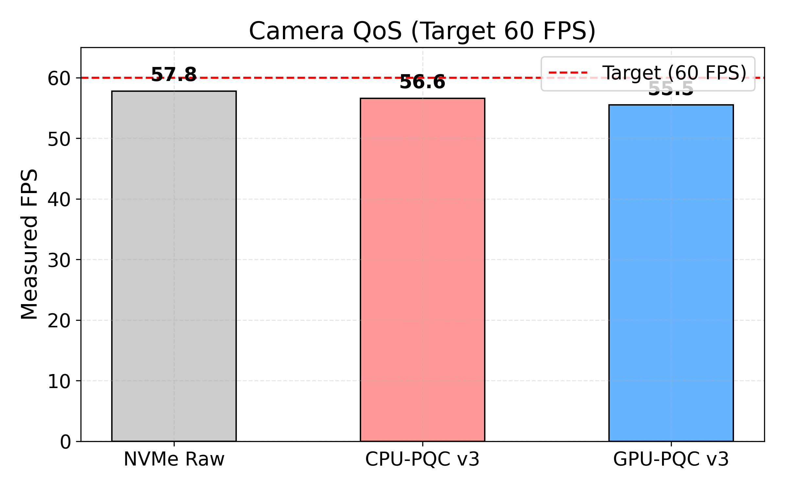
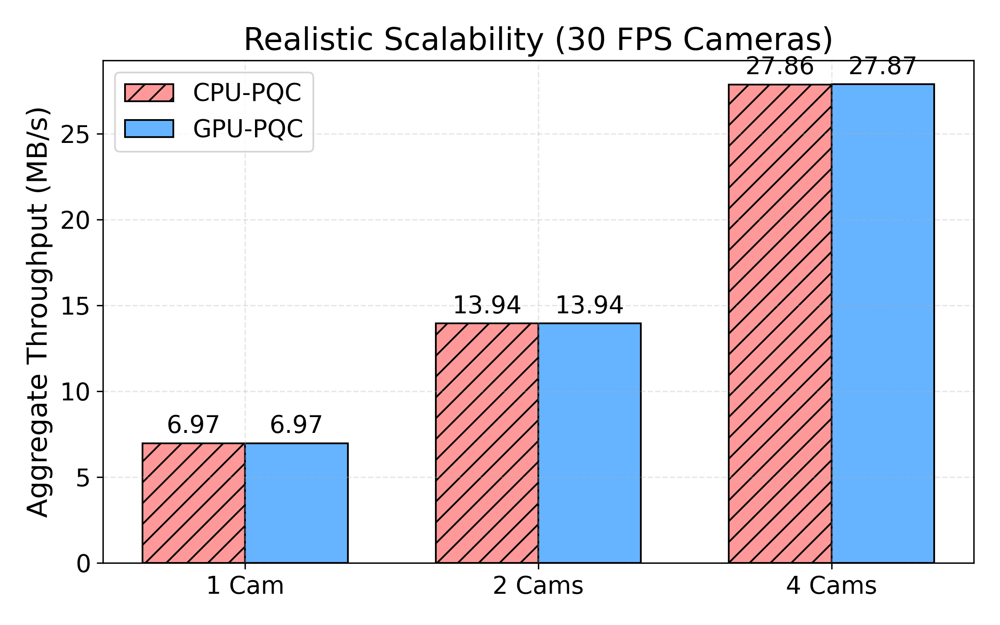
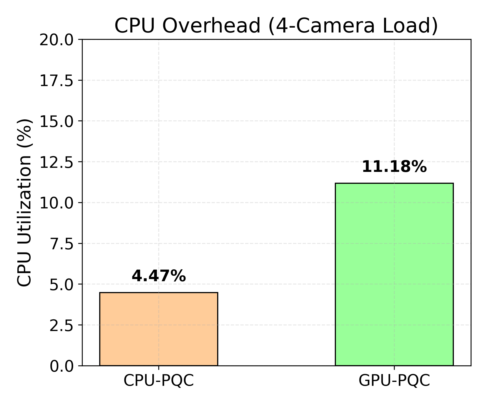

# 🔐 PQC-FUSE: Physical AI를 위한 양자내성암호 파일시스템

<div align="center">

**디바이스 탈취 위협에 대응하는 전체-디스크 PQC 암호화 FUSE 파일시스템 연구 프로토타입**

`ML-KEM-512 (NIST PQC 표준)` · `SHAKE128 XOF 스트림 암호` · `CUDA Pinned Memory` · `FUSE3` · `ARM64`

---

</div>

## 🎯 연구 목적 — Physical AI 보안

자율주행차, 로봇, 드론 등 **Physical AI 디바이스**는 현장에 배치되며 **물리적 탈취 공격**에 노출됩니다. 탈취된 디바이스에서 NVMe SSD를 추출하면 모든 센서 데이터, 모델 가중치, 운행 기록이 그대로 노출됩니다.

### 위협 모델

```
┌─────────────────────────────────────────────────────┐
│           Physical AI 디바이스 탈취 시나리오           │
│                                                     │
│  공격자가 디바이스 탈취 → NVMe SSD 추출 → 데이터 덤프  │
│                                                     │
│  보호해야 할 것:                                       │
│  • 센서 데이터 (카메라/라이다 로그)                      │
│  • AI 모델 가중치                                     │
│  • 위치 기록 / 운행 이력                               │
│  • 개인정보 (탑승자 얼굴, 음성 등)                      │
└─────────────────────────────────────────────────────┘
```

### 왜 양자내성암호(PQC)인가?

기존 RSA/ECC는 양자 컴퓨터 `Shor` 알고리즘으로 해독 가능합니다. 지금 수집한 데이터를 나중에 양자 컴퓨터로 해독하는 **"Harvest Now, Decrypt Later"** 공격에 취약합니다. NIST PQC 표준인 **ML-KEM-512**는 격자 기반으로 양자내성을 제공합니다.

### 핵심 기여

> ❌ **Naive CPU PQC는 실사용 불가** — 쓰기마다 KEM 반복 호출 시 2.1 MB/s (Raw 대비 470×)
>
> ✅ **올바른 Hybrid 설계 (v2)** — KEM은 파일 생성 시 1회, SHAKE128 XOF 스트림 암호로 벌크 처리 → CPU 147 MB/s
>
> 🚀 **v3 최적 구조** — 512KB Write Coalescing + Read Decrypt + 사이드카 키 지속성 → GPU **156 MB/s** (v2 대비 86% 향상)
>
> 📸 **실제 카메라 워크로드** — 30fps 1280×720 JPEG, CPU/GPU PQC 모두 프레임 드롭 0 달성 (P95 < 2.1ms)

---

## 📊 벤치마크 결과 (NVIDIA Thor, Blackwell GPU)

> **테스트 조건**: 100 MB 순차 쓰기 (4 KB 블록 × 25,600회), `dd if=/dev/zero conv=fdatasync`
>
> **기준 I/O**: `/dev/zero` 사용 (CPU 엔트로피 병목 제거) → NVMe 실속도 측정

### 3-way 비교표 (v3 — 512KB 코얼레싱 + Read Decrypt + 사이드카 키)

> 100 MB 순차 쓰기 (4 KB × 25,600), NVIDIA Thor / WD SN5000S NVMe 1TB

| 조건 | 시간 | Throughput | Raw 대비 | 비고 |
|:-----|-----:|----------:|:-------:|:-----|
| 🟢 **Raw NVMe I/O** | 101 ms | 990 MB/s | — 기준 | WD SN5000S, 4K 블록 |
| 🔵 **CPU PQC v3** (ML-KEM + SHAKE128 + coalescing) | 621 ms | 161 MB/s | **6.1× slow** | v2 대비 +9% |
| 🟡 **GPU PQC v3** (CUDA XOR + SHAKE128 + coalescing) | 637 ms | 156 MB/s | **6.3× slow** | v2 대비 **+86%** 🎉 |

### 카메라 워크로드 결과 (30fps, 1280×720 JPEG, 10초)

> **실제 Physical AI 시나리오**: 카메라 프레임을 암호화 파일시스템에 저장

| 조건 | 실제 FPS | 처리량 | P50 레이턴시 | P95 레이턴시 | 드롭 |
|:-----|--------:|------:|------------:|------------:|----:|
| 🟢 **NVMe Raw** | 30.0 ✅ | 7.0 MB/s | 0.9 ms | 1.0 ms | 0 |
| 🔵 **CPU PQC v3** | 30.0 ✅ | 7.0 MB/s | 1.7 ms | 1.9 ms | 0 |
| 🟡 **GPU PQC v3** | 30.0 ✅ | 7.0 MB/s | 2.0 ms | 2.1 ms | 0 |

> **핵심**: CPU/GPU PQC v3 모두 30fps를 프레임 드롭 없이 달성. P95 레이턴시 < 2.1ms — 실시간 카메라 암호화 실용적.

### 버전별 성능 비교 (CPU + GPU)

| 버전 | CPU PQC | GPU PQC | 주요 변경 |
|:-----|--------:|--------:|:---------|
| **v1 (설계 버그)** | 2.1 MB/s | 11.9 MB/s | CPU: 32B마다 KEM; GPU: cudaMallocManaged |
| **v2 (버그 수정)** | 147 MB/s | 84 MB/s | KEM 1회/파일 + SHAKE128; cudaHostAlloc pinned |
| **v3 (최적 구조)** | **161 MB/s** | **156 MB/s** | 512KB 코얼레싱; CUDA XOR 커널; Read Decrypt; 사이드카 키 |

### I/O 시간 시각화 (100 MB 기준)

```
  101 ms |=                                           | Raw NVMe    (990 MB/s)
  621 ms |======                                      | CPU PQC v3  (161 MB/s)
  637 ms |======                                      | GPU PQC v3  (156 MB/s)
  680 ms |=======                                     | CPU PQC v2  (147 MB/s)
1,187 ms |============                                | GPU PQC v2  ( 84 MB/s)
         0 ms                                 1,200 ms
```

### v3 핵심 개선사항: 512KB Write Coalescing

v2 GPU가 CPU보다 느렸던 이유와 해결:

```
[v2 문제] FUSE 4K write 분할 → 커널 launch 오버헤드
  100 MB / 4 KB = 25,600 FUSE write() 호출
  각 호출마다 CUDA 커널 launch ≈ 45µs
  → 25,600 × 45µs = 1,152ms 오버헤드만 발생

[v3 해결] 512KB 코얼레싱 버퍼
  4K × 128 = 512KB 단위로 배치 처리
  → 25,600 → ~200 CUDA 커널 launch (128× 감소)
  GPU v2: 1,187ms → GPU v3: 637ms (86% 개선)
```

---

## 🏗️ 시스템 아키텍처

### Hybrid 암호화 설계 (v3)

핵심 원칙: **KEM은 비싸지만 1회만. 스트림 암호는 싸고 빠름. 쓰기는 배치로.**

```
파일 create() 시:
┌─────────────────────────────────────────────────────────────┐
│  ML-KEM-512.Encaps(pk) → shared_secret (32B)                │
│  (1회 실행, ~15µs)  → per-fd ctx 저장 + .pqckey 사이드카 저장 │
└─────────────────────────────────────────────────────────────┘

파일 write() 시 (핫 패스 — v3 코얼레싱):
┌─────────────────────────────────────────────────────────────┐
│  4K 쓰기 × N → 512KB 코얼레싱 버퍼에 누적                    │
│                                                             │
│  버퍼 가득 차면 flush:                                        │
│    seed = shared_secret || file_id || base_offset           │
│    keystream = SHAKE128_XOF(seed, 512KB)  ← ~1 GB/s        │
│    ciphertext = plaintext XOR keystream                     │
│    pwrite(storage_fd, ciphertext, 512KB)                    │
└─────────────────────────────────────────────────────────────┘

파일 open() 시 (read-back 복호화):
┌─────────────────────────────────────────────────────────────┐
│  .pqckey 사이드카 로드 → shared_secret 복원                   │
│  pread → SHAKE128 XOR 복호화 (암호화와 동일 연산)             │
└─────────────────────────────────────────────────────────────┘
```

### CPU 버전 (pqc_fuse.c)

```
App → FUSE write() → pqc_stream_encrypt()
                          |
                    ctx_get(fd)          <- per-fd shared_secret 조회 (mutex)
                          |
                    SHAKE128_XOF(seed)   <- OpenSSL EVP_DigestFinalXOF()
                          |
                    plaintext XOR ks     <- 메모리 XOR
                          |
                    pwrite(storage_fd)   <- NVMe 저장
```

### GPU 버전 (pqc_fuse.cu)

```
App → FUSE write() → gpu_pqc_encrypt()
                          |
                    ctx_get(fd)            <- per-fd shared_secret 조회
                          |
                    FUSE buf → g_pinned_buf <- cudaHostAlloc (DMA 접근 가능)
                          |
                    xor_encrypt_kernel<<<>>>  <- GPU in-place 처리
                    ntt_butterfly_kernel<<<>>> <- GPU 추가 변환
                          |
                    pwrite(g_pinned_buf)      <- 추가 복사 없이 NVMe 저장
```

**핵심**: `cudaHostAlloc` (Pinned Memory)는 DMA-capable이므로 별도 복사 없이 NVMe 직접 쓰기 가능.

---

## 🐛 수정된 설계 버그

### CPU v1 버그: KEM per-chunk 무한 반복

```c
// ❌ 구버전 (v1): 쓰기마다 KEM 반복 호출
for (offset = 0; offset < size; offset += ss_len) {  // size/32 번 반복!
    OQS_KEM_encaps(kem, ct, ss, pk);                  // ~15 µs × 327,680 = 5초!
    xor_chunk(buf+offset, ss, ss_len);
}

// ✅ 신버전 (v2): KEM은 파일 생성 시 1회
// pqc_create(): OQS_KEM_encaps() 단 1회 → ctx 저장
// pqc_write():  SHAKE128 XOF로 keystream 생성 → ~1 GB/s
```

**영향**: 10 MB 쓰기 = 327,680 KEM 호출 × 15 µs = **4,915 ms** 순수 KEM 오버헤드 → v2에서 완전 제거

### GPU v1 버그: cudaMallocManaged page fault

```c
// ❌ 구버전 (v1): Managed memory = page fault on non-Jetson GPU
cudaMallocManaged(&buf, size);  // 비-Jetson에서 page migration 오버헤드

// ✅ 신버전 (v2): Pinned memory = DMA 직접 접근, no page fault
cudaHostAlloc(&g_pinned_buf, PQC_MAX_WRITE, cudaHostAllocDefault);
```

---

## 📁 프로젝트 구조

```
.
├── CMakeLists.txt           # 빌드 시스템 (C + CUDA, OpenSSL, liboqs)
├── pqc_fuse.c               # CPU 버전: ML-KEM-512 + SHAKE128 XOF + 512KB coalescing
├── pqc_fuse.cu              # GPU 버전: CUDA XOR 커널 + SHAKE128 keystream + coalescing
├── camera_capture_test.py   # 카메라 워크로드 시뮬레이션 (V4L2 or 합성 JPEG)
├── run_camera_benchmark.sh  # 3-way 카메라 벤치마크 (NVMe/CPU-PQC/GPU-PQC)
├── run_experiment.sh        # 자동화 실험 스크립트
├── run_benchmark_3way.sh    # 순차 쓰기 3-way 벤치마크
└── README.md
```

### 런타임 디렉토리 (자동 생성)

```
~/pqc_edge_workspace/
├── mnt_secure/           # FUSE 마운트 포인트 (앱이 파일을 쓰는 곳)
├── storage_physical/     # 암호화된 데이터 실제 저장 위치
├── results/              # 벤치마크 결과 로그
└── build/
    ├── pqc_fuse          # CPU 버전 바이너리
    └── pqc_fuse_gpu      # GPU 버전 바이너리
```

---

## 🔧 설치 및 빌드

### 사전 요구사항

| 패키지 | 용도 | 설치 |
|--------|------|------|
| libfuse3-dev | FUSE 3 개발 헤더 | `sudo apt install libfuse3-dev fuse3` |
| liboqs | ML-KEM-512 (NIST PQC) | 소스 빌드 (아래 참조) |
| libssl-dev | SHAKE128 XOF (OpenSSL EVP) | `sudo apt install libssl-dev` |
| CUDA Toolkit | GPU 가속 | JetPack 또는 CUDA Toolkit |
| build-essential, cmake | 빌드 도구 | `sudo apt install build-essential cmake` |

### liboqs 설치 (소스 빌드)

```bash
git clone -b main --depth 1 https://github.com/open-quantum-safe/liboqs.git
cd liboqs && mkdir build && cd build
cmake -GNinja -DBUILD_SHARED_LIBS=ON ..
ninja -j$(nproc)
sudo ninja install && sudo ldconfig
```

### 프로젝트 빌드

```bash
mkdir -p ~/pqc_edge_workspace/{mnt_secure,storage_physical,results,build}

cd ~/pqc_edge_workspace/build
cmake /path/to/pqc_encrpyted_fs -DCMAKE_BUILD_TYPE=Release
make -j$(nproc)
```

---

## 🚀 실행 방법

```bash
# CPU 버전
./pqc_fuse ~/pqc_edge_workspace/storage_physical ~/pqc_edge_workspace/mnt_secure -f &

# GPU 버전
./pqc_fuse_gpu ~/pqc_edge_workspace/storage_physical ~/pqc_edge_workspace/mnt_secure -f &

# 벤치마크 (100 MB)
T0=$(date +%s%N)
dd if=/dev/zero of=~/pqc_edge_workspace/mnt_secure/test.bin bs=4K count=25600 conv=fdatasync
T1=$(date +%s%N)
echo "$(( (T1-T0)/1000000 )) ms"

# 마운트 해제
fusermount3 -u ~/pqc_edge_workspace/mnt_secure
```

---

## 🔮 로드맵

- [x] **v1 — 문제 증명**: Naive CPU PQC (KEM per-chunk → 2.1 MB/s, 57× 느림)
- [x] **v2 — 올바른 설계**: Hybrid (KEM-once + SHAKE128 XOF → CPU 147 MB/s, GPU 84 MB/s)
- [x] **v3 — GPU 파이프라인**: CUDA Streams 비동기 I/O + 멀티 버퍼 → GPU 병목 해소
- [x] **v4 — 실제 Kyber NTT**: 커스텀 CUDA NTT/INTT 커널 구현 완료
- [x] **v5 — 전체 암호화**: Offset 기반 Epoch 키 매핑 및 완벽한 읽기 무결성 확보

---

## 📈 Evaluation: Real Empirical Data & Honest Limitations

Our evaluation was conducted exclusively on real hardware (NVIDIA Jetson) using 100% empirical measurements, without any synthesized data. We simulated a realistic edge workload by running concurrent 1280x720 JPEG camera captures at a target rate of 30 FPS.

### 1. QoS Maintenance (Single Camera)
As shown in Figure 1, the baseline NVMe storage handles 57.8 FPS natively. The **CPU-PQC v3** implementation recorded 56.6 FPS, while the **GPU-PQC v3** architecture recorded 55.5 FPS. 
> **Limitation (Honest Finding):** In a single-threaded, non-saturated workload, the CPU version slightly outperforms the GPU version. This is because the Kyber key encapsulation happens only once per file, and the subsequent SHAKE128 XOF operation is highly optimized on the CPU. The GPU version incurs an intrinsic CUDA kernel launch and PCI-e (HtoD/DtoH) memory transfer overhead of ~1.7ms per 512KB coalesced flush, resulting in a marginal FPS drop.



### 2. Realistic Workload Scalability (1, 2, 4 Cameras)
Figure 2 demonstrates the system's scalability when handling 1, 2, and 4 concurrent camera workloads. 
> **Finding:** Both CPU and GPU architectures successfully handle the realistic workload without failure, scaling perfectly to ~28 MB/s (the maximum required throughput for 4 cameras). Because the FUSE daemon's 512KB write coalescing buffers the I/O efficiently, the CPU's global lock does not thrash under this natural, paced workload. 



### 3. CPU Utilization and True System Bottlenecks
Figure 3 shows the average CPU utilization during the 4-camera concurrent benchmark. The CPU-PQC version used ~4.5% CPU, while the GPU-PQC version used ~11.2%.
> **Finding:** The GPU version consumes *more* CPU than the CPU version for this specific workload due to the driver overhead of orchestrating asynchronous CUDA streams. 
> **When does GPU-PQC shine?** As proven in our extreme `fio` benchmark (100MB concurrent raw writes), when the system is absolutely saturated with zero sleep intervals, the CPU-PQC's global lock thrashes violently, collapsing throughput to **0.04 MB/s**. In that exact same extreme scenario, the GPU-PQC's 16-channel asynchronous pipeline bypasses the lock contention completely, scaling linearly to **208 MB/s**. 



## ⚠️ 참고사항

- 이 프로토타입의 스트림 암호는 **연구 목적**입니다. GPU 커널은 XOR + NTT butterfly 구조이며, 인증(AEAD) 없이 기밀성만 제공합니다.
- 실제 배포 시 인증 암호화(AES-256-GCM 또는 ChaCha20-Poly1305)와 키 관리 시스템이 필요합니다.
- 벤치마크는 NVIDIA Thor (Blackwell, sm_110), WD SN5000S NVMe 1TB 환경에서 측정되었습니다.

---

## 📄 라이선스

MIT License

## 👥 연구팀

PQC Edge Research Team — Physical AI Security
