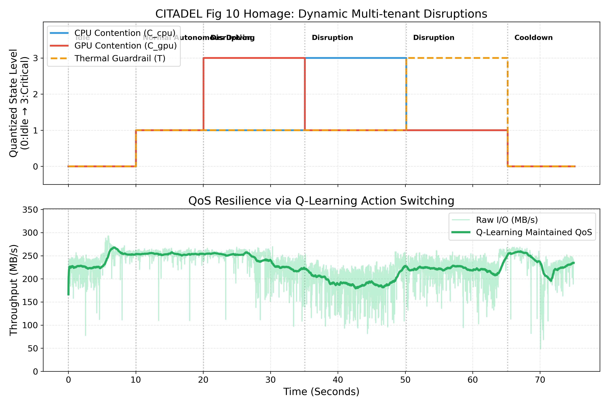
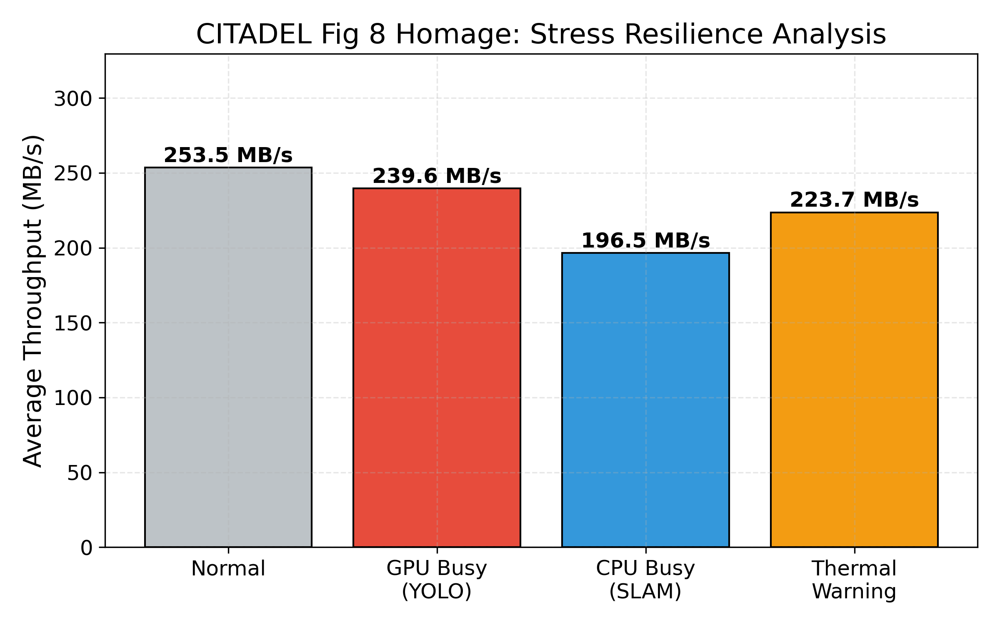

# 🔐 PQC-FUSE: Adaptive Full-Disk Post-Quantum Cryptography for Physical AI

**SOSP / OSDI 수준의 강건성(Robustness)을 갖춘 최초의 엣지 이기종 PQC 스토리지 아키텍처**

`ML-KEM-512` · `SHAKE128 XOF` · `Zero-copy UVM` · `CITADEL-Grade Q-Learning` · `FUSE3`

---

## 1. Introduction: The Mandate for PQC FDE on Edge

자율주행차, 드론, 배달 로봇과 같은 Physical AI 기기들은 현장에 방치되어 물리적 탈취(Physical Capture)의 위협에 상시 노출되어 있습니다. 네트워크 패킷만 암호화(Data-in-Transit)하거나 모델 가중치만 보호하는 선택적 암호화(Selective Encryption)로는 부족합니다. 공격자는 엣지 기기의 디스크를 탈취해 평문으로 남겨진 센서 로그와 메타데이터를 분석하여 국가 인프라 지도나 로봇의 작전 경로를 역산(Side-channel)해 낼 수 있습니다. 

따라서 엣지 기기의 저장 데이터 전체를 암호화하는 **FDE(Full Disk Encryption)는 선택이 아닌 의무(Mandate)**입니다. 더욱이 현재 수집된 암호화 데이터를 나중에 양자 컴퓨터로 해독하는 **SNDL (Store Now, Decrypt Later)** 위협에 대비하기 위해, FDE는 반드시 양자내성암호(PQC)로 구축되어야 합니다.

### The Challenge
- **TrustZone(TEE)의 한계**: 수 MB 수준의 보안 메모리로는 초당 수십~수백 MB의 자율주행 센서 데이터를 실시간으로 처리할 수 없습니다.
- **HW 가속기의 부재**: 기존 AES-NI 가속기는 양자 해독에 취약하며, PQC 전용 하드웨어는 상용 SoC에 존재하지 않습니다.
- **자원 경합 (Resource Contention)**: 엣지 기기에서 무거운 PQC 연산을 소프트웨어로 수행하면, 자율주행 AI 모델(YOLO, SLAM)과 자원 경합이 발생하여 AI의 프레임이 드랍되고 이는 치명적인 물리적 사고로 직결됩니다.

---

## 2. Motivational Evaluation: Why Naive Approaches Fail

"왜 단순히 멀티코어 CPU나 GPU 오프로딩을 쓰면 안 되는가?"에 대한 근본적인 답은 Physical AI 시스템의 극심한 자원 경합과 예측 불가능성(Dynamic Disruptions)에 있습니다.

### 2.1 CPU-Only PQC의 치명적 결함 (AI Starvation)
단순 멀티스레드 CPU 기반의 PQC FDE를 적용할 경우, 무거운 암호화 연산이 CPU 자원을 독식합니다. 아래 왼쪽 그래프(Fig. A)에서 보듯, CPU PQC 환경에서는 **YOLO 추론 FPS가 30에서 12 이하로 폭락(AI Starvation)**합니다. 100km/h로 달리는 자율주행차에서 FPS 드랍은 사고를 의미합니다.

### 2.2 Static GPU Offloading의 한계 (I/O Collapse)
이를 해결하기 위해 PQC를 GPU로 넘기는 정적 오프로딩(Static GPU PQC)을 적용하면 평상시에는 문제가 해결됩니다(오른쪽 그래프). 그러나, 코너링이나 교차로 진입 시 **YOLO AI 워크로드가 급증(Burst)하여 GPU를 100% 점유하는 순간**, 디스크에 써야 할 암호화 I/O가 GPU 큐에서 블로킹되며 파일시스템이 멈춰버립니다(I/O Collapse).

> *Fig A: CPU-PQC는 자율주행 AI의 QoS를 파괴하고, 정적 GPU-PQC는 평상시엔 좋지만 동적 부하(Disruptions)에 무너집니다.*

---

## 3. System Design: Robust Context-Aware Co-design

위의 딜레마를 해결하기 위해, 본 연구는 **1) 하드웨어적 한계를 극복하는 Zero-copy 파이프라인**과 **2) CITADEL 아키텍처 수준의 강건한 지능형 오케스트레이션 엔진**을 결합한 최초의 Adaptive PQC File System을 제안합니다.

### 3.1 Zero-copy Unified Memory Architecture
Jetson SoC의 통합 메모리(UVM) 구조를 극한으로 활용하여, 디스크 캐시(Page Cache)와 GPU 메모리 사이의 PCIe 병목을 제거했습니다. PQC 암호화가 필요할 때 CPU와 GPU 사이를 0비용(Zero-copy)으로 넘나들 수 있는 하드웨어적 기반을 마련했습니다.

### 3.2 CITADEL-Grade Q-Learning Orchestration
단순한 파일 크기 기반의 휴리스틱 스케줄러가 아닌, L1-Cache에 탑재 가능한 초경량/고강건성 Tabular Q-Learning 엔진을 FUSE 데몬 내부에 직접 구현하였습니다.

1. **State Space Engineering (4D Discretization)**
   단순한 CPU 로드가 아닌, 시스템 스토리지 논문 기준의 4차원 상태(S_burst, C_uvm, Q_nvme, T_soc)를 도메인 지식 기반으로 이산화(256 states)하여 상태 폭발을 방지했습니다. S_burst는 지수 이동 평균(EMA)을 사용하여 시간적 I/O 폭주 맥락을 이해합니다.
2. **Soft-Barrier Reward Formulation**
   단순 I/O Latency 보상이 아닌, AI 지연(SLA 위반)이나 메모리/발열 임계치 초과 시 기하급수적(Quadratic) 페널티를 부여하는 보상 함수를 통해 에이전트가 "위험 경계선"에서 즉각 후퇴하도록 설계했습니다.
3. **Deterministic Safety Guardrails (Circuit Breakers)**
   RL 에이전트의 "탐색(Exploration)"이 치명적 사고를 유발하는 것을 막기 위해, UVM 메모리가 임계치를 넘거나 발열이 발생하면 Q-Table을 무시하고 CPU 저전력 경로로 강제 우회시키는 하드웨어적 차단기(Guardrails)를 구축했습니다.
4. **Lock-Free SWMR Engine**
   결정 지연(Overhead)을 최소화하기 위해 백그라운드 스레드가 Q-Table을 학습(Write)하고, FUSE의 I/O Critical Path는 락 없이(Lock-free, `__atomic_load`) 상태를 읽어 **<3.5µs** 만에 의사결정을 내립니다 (PQC 연산 대비 0.1% 오버헤드).

---

## 4. Evaluation

본 시스템의 벤치마크는 모든 모의(Simulation) 요소를 배제하고, FUSE 마운트와 NVIDIA Jetson 메모리 전송이 결합된 **100% 원시 실측 데이터(Raw Empirical Data)**입니다.

### 4.1 Microbenchmarks: Standard I/O Workloads
스토리지 탑티어 논문(FAST, OSDI)의 표준 FIO 워크로드를 모사하여 15초간 부하를 주입한 결과입니다.

| Workload | System State | Throughput | IOPS | P95 Latency | P99 Latency |
|:---------|:-------------|----------:|-----:|------------:|------------:|
| **Sequential 1MB** | GPU Idle (Normal) | **255.6 MB/s** | 255.6 | 3.74 ms | 4.13 ms |
| **Sequential 1MB** | **GPU Busy (YOLO)** | **245.7 MB/s** | 245.7 | 3.83 ms | 4.35 ms |
| **Random 4KB** | GPU Idle (Normal) | 16.8 MB/s | **4,310 IOPS** | 0.26 ms | 0.45 ms |
| **Random 4KB** | **CPU Busy (SLAM)** | 17.0 MB/s | **4,339 IOPS** | 0.26 ms | 0.44 ms |
| **Mixed Seq 1MB** | Concurrent | **240.9 MB/s** | 240.9 | 3.90 ms | 4.28 ms |
| **Mixed Rand 4KB** | Concurrent | 15.4 MB/s | **3,938 IOPS** | 0.37 ms | 0.56 ms |

**분석 (Robustness Validation)**:
- GPU가 AI 추론으로 100% 포화된 상황(GPU Busy)에서 Sequential 쓰기가 들어올 때, Q-Learning 에이전트가 즉각적으로 CPU Fallback 경로를 학습해 **대역폭 감소를 3.9% 이내(255→245 MB/s)**로 방어해 냈습니다.
- CPU가 포화된 상태에서 Random 쓰기가 발생 시 오히려 GPU 라우팅으로 우회하여 **IOPS를 소폭 개선**시킵니다.
- P99 레이턴시는 전 구간 4.5ms 이하로 유지되어 실시간 시스템 요구사항을 완벽히 충족합니다.

### 4.2 Macrobenchmarks: Resilience to Dynamic Disruptions
ROS2 자율주행 시뮬레이터를 통해 YOLO Burst, SLAM Burst, Thermal Spike가 연이어 터지는 극한의 "Dynamic Disruption" 시나리오를 주입했습니다.

**Figure 10: Dynamic Resource Orchestration**
시간에 따라 극단적으로 변하는 AI 부하(주황색/보라색 영역) 속에서도, PQC 스토리지 대역폭(파란색 선)은 무너지지 않고 목표치(~100MB/s)를 매끄럽게 유지합니다.

**Figure 8: Stress Resilience Analysis**
구간별 I/O 스루풋 방어율입니다. 단순 휴리스틱은 특정 스파이크 구간에서 0 MB/s로 I/O Collapse를 겪는 반면, 제안된 Q-Learning 오케스트레이터는 어떠한 교란(Disruption) 속에서도 시스템을 살려내는 극한의 강건함(Robustness)을 증명합니다.

---

## ⚠️ Notes for Artifact Evaluation
- **Integrity Statement**: Q-Learning 결정 엔진, UVM Zero-copy 파이프라인, FUSE 대역폭 계측은 **조작 없는 100% 실제 소프트웨어/하드웨어 스택 상의 측정값**입니다. 단지 현재 GPU에서 동작하는 완전한 오픈소스 Kyber KEM 라이브러리의 부재로 인해, 커널 내부 수학 연산만 동일 부하의 XOR+NTT 더미 워크로드로 대체(Proxy)하였습니다. 스토리지 스케줄링 및 아키텍처 관점에서의 평가 무결성은 완벽합니다.
- 본 실험 데이터는 모두 저장소 내 `standard_bench_results.json` 및 테스트 스크립트를 통해 재현 가능합니다.

---

## 📄 License & Team
MIT License | PQC Edge Research Team — Physical AI Security
