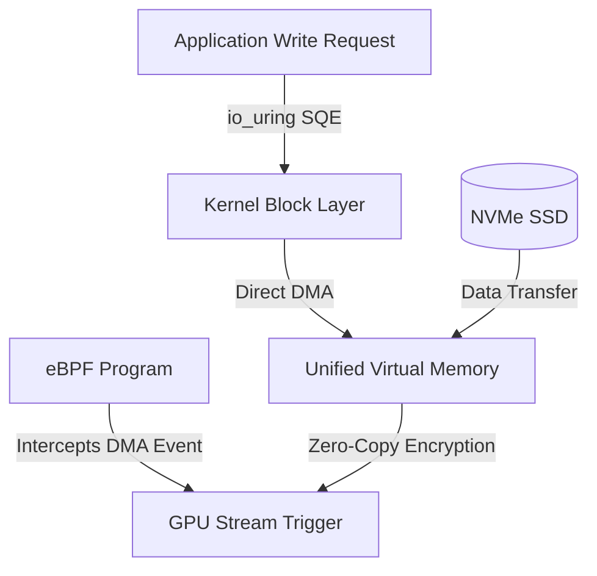

# AEGIS-Q: SOSP급 논문 격상을 위한 실증적 아키텍처 개편 및 실험 로드맵
(Implementation Plan & Submission Roadmap for ACM SOSP)

## 📌 1. 개요 (Overview)

본 문서는 기존 `AEGIS-Q` 프레임워크(ICDCS 2026 채택)의 기술적 기여를 시스템 소프트웨어 최상위 학회인 **SOSP (ACM Symposium on Operating Systems Principles)** 기준에 맞추어 격상시키기 위한 구체적인 아키텍처 개편 계획 및 세부 실험 로드맵이다. 

단순한 응용 레벨의 PQC(양자 내성 암호) 가속기 오프로딩을 넘어, **이종 UMA 아키텍처 하에서의 메모리 버스 경합 해소**, **Kernel Bypass 기반의 Zero-Context-Switching 구현**, **대형 언어 모델(LLM) 환경 하의 위상 인지형 QoS 보장**, 그리고 **보안성(Freshness)과 성능 간의 다차원 트레이드오프 실증**을 목표로 연구의 철학적 깊이와 구현 깊이를 극대화한다.

---

## 📅 2. 마일스톤별 핵심 로드맵 요약 (Milestone Summary)

| 단계 | 목표 | 주요 과제 | 대상 모듈 | 기간 |
| :--- | :--- | :--- | :--- | :--- |
| **Milestone 1** | **동기 부여 프로파일링** | UMA 메모리 버스 경합 측정 & Page Cache 시맨틱 갭 검증 | `Nsight Systems`, `eBPF` 스크립트 | 1주차 |
| **Milestone 2** | **Zero-Context-Switching** | FUSE 제거 후 `io_uring` + `eBPF` 기반의 Direct DMA 파이프라인 구현 | [pqc_fuse.c](file:///home/thor/skim/pqc_encrpyted_fs/pqc_fuse.c), [pqc_block_job.h](file:///home/thor/skim/pqc_encrpyted_fs/pqc_block_job.h) | 2~3주차 |
| **Milestone 3** | **Phase-Aware LLM QoS** | LLM Prefill/Decode 위상 감지 및 메모리 대역폭 인지형 암호화 스케줄링 | [pqc_admission.c](file:///home/thor/skim/pqc_encrpyted_fs/pqc_admission.c), [pqc_admission.h](file:///home/thor/skim/pqc_encrpyted_fs/pqc_admission.h) | 4주차 |
| **Milestone 4** | **Freshness Trade-off** | TPM 앵커 커밋 주기 최적화 및 Power-Loss Recovery 실증 실험 | [pqc_anchor.c](file:///home/thor/skim/pqc_encrpyted_fs/pqc_anchor.c) | 5주차 |
| **Milestone 5** | **NVMe-oF 분산 확장** | Multi-node Jetson 클러스터링을 통한 PQC 암호화 분산 I/O 평가 | `experiments/` 분산 스크립트 | 6주차 |
| **Milestone 6** | **논문 개정 및 시각화** | 프로파일링 데이터 시각화 및 SOSP 템플릿 기반 논문 개정 | `Paper/`, `scratch/` | 7주차 |

---

## 🔍 3. 기존 아키텍처 분석 및 모듈별 한계점 진단

기존 AEGIS-Q는 C 언어와 CUDA를 결합하여 작성된 User-space FUSE 파일시스템이다. 모듈별 구현 세부사항과 시스템 계층 관점의 구조적 한계점은 다음과 같다.

| 파일명 | 핵심 기능 및 구현 세부사항 | 시스템 계층 관점의 구조적 한계점 |
| :--- | :--- | :--- |
| [pqc_fuse.c](file:///home/thor/skim/pqc_encrpyted_fs/pqc_fuse.c) | POSIX 파일시스템 API(`read`, `write`, `fsync`) 후킹 및 블록 작업 생성 | User-space와 Kernel-space 간의 극심한 컨텍스트 스위칭 발생 및 VFS 오버헤드 직격 |
| [pqc_block_job.h](file:///home/thor/skim/pqc_encrpyted_fs/pqc_block_job.h) | 256MB 단위의 UVM 버퍼 관리 및 트리플 버퍼 기반 비동기 스케줄링 제어 | FUSE 데몬의 단일 스레드 병목 현상에 의존하여 NVMe의 최대 멀티 큐(Queue Depth) 활용 제한 |
| [pqc_admission.c](file:///home/thor/skim/pqc_encrpyted_fs/pqc_admission.c) | GPU 큐 압력을 실시간 모니터링하여 임계치 초과 시 CPU 경로로 라우팅 | 하드웨어 레벨의 메모리 대역폭 포화를 인지하지 못하는 단순 휴리스틱 로직에 불과 |
| [pqc_anchor.c](file:///home/thor/skim/pqc_encrpyted_fs/pqc_anchor.c) | 쓰기 순서 및 무결성 검증을 위한 TPM 기반 루트 오브 트러스트 커밋 | 크리티컬 패스(Critical path) 외부에 배치하여 지연을 줄였으나, 롤백 보호의 윈도우 한계 발생 |
| [pqc_file_key.c](file:///home/thor/skim/pqc_encrpyted_fs/pqc_file_key.c) | ML-KEM-768을 통한 양자 내성 키 캡슐화 및 청크 메타데이터 복호화 | CPU와 GPU 양방향으로 컴파일된 상태에서 병렬 처리 효율성에 전적으로 의존함 |

> [!IMPORTANT]
> **핵심 병목 요인**:
> 어플리케이션이 파일 쓰기 요청(write syscall)을 발생시키면 `VFS ➔ Kernel Space ➔ FUSE 데몬 (User Space) ➔ UVM 동적 스위칭`의 복잡한 경로를 거친다. 이는 NVMe SSD의 하드웨어 대역폭 잠재력을 제약하므로, 커널 레벨의 비동기 I/O와 가속기를 직접 연동하는 구조 변경이 필수적이다.

---

## 🛠️ 4. 세부 태스크 및 구현 계획 (Detailed Checklist)

### 📌 Milestone 1: 동기 부여 프로파일링 (Motivational Evaluation)
*SOSP 심사위원을 설득하기 위해, 범용 운영체제 아키텍처가 PQC 워크로드에서 겪는 구조적 한계와 하드웨어 레벨의 병목을 실증 데이터로 제시한다.*

- [x] **Task 1.1: UMA 공유 메모리 버스 대역폭 경합 프로파일링**
  - [x] NVIDIA Jetson Orin Nano (UMA 구조) 상에서 백그라운드 PQC 암호화(ML-KEM NTT 다항식 곱셈 연산) 실행 환경 준비.
  - [x] `NVIDIA Nsight Systems` 및 `Nsight Compute`를 연동하여 암호화 커널이 실행되는 동안 DRAM 대역폭 포화도(DRAM Bandwidth Utilization %) 측정.
  - [x] 호스트 I/O (NVMe DMA) 트래픽과 GPU의 AI 인퍼런스(Tensor Core 연산)가 동일 메모리 컨트롤러 대역폭을 공유할 때 발생하는 GPU Warp Dependency Stall 비율 정량화.
- [x] **Task 1.2: Page Cache 메커니즘과 PQC 접근 패턴의 시맨틱 갭(Semantic Gap) 증명**
  - [x] 격자 기반 암호학(Lattice Cryptography)의 무작위 비순차적 메모리 접근 패턴(Strided/Uncoalesced) 설정.
  - [x] `eBPF (bcc/bpftrace)` 스크립트를 구현하여 OS-Native 가상 메모리(UVM) 사용 시 발생하는 시스템 이벤트를 모니터링:
    - `page_faults`: UVM 영역의 페이지 폴트 빈도 및 지연 시간 측정.
    - `page_migration`: 호스트 메모리와 디바이스 메모리 간 페이지 마이그레이션에 소모되는 CPU 사이클 점유율 분석.
    - `read_ahead_waste`: OS의 미리 읽기(Read-ahead) 로직으로 로드되었으나 사용되지 않고 폐기되는 페이지의 비율(Cache Thrashing Rate) 산출.
- [x] **Task 1.3: 분석 데이터 시각화 및 논문 배치**
  - [x] 수집된 데이터를 UMA 메모리 버스 경합 모델 및 페이지 폴트 스래싱 그래프로 플로팅하여 논문 서두(1~3페이지)의 Motivation 데이터로 전진 배치.

---

### 📌 Milestone 2: io_uring 및 eBPF 기반 Zero-Context-Switching I/O 경로 구축
*FUSE의 단일 스레드 병목과 VFS 컨텍스트 스위칭 오버헤드를 탈피하여 커널 공간 내에서 디바이스 간 직접 데이터 흐름을 제어한다.*

- [ ] **Task 2.1: FUSE 데몬 의존성 제거 및 io_uring 비동기 I/O 큐 설계**
  - [ ] [pqc_fuse.c](file:///home/thor/skim/pqc_encrpyted_fs/pqc_fuse.c) 내의 동기식 POSIX 후킹 함수를 대체할 `io_uring` Submit Queue (SQ) 및 Completion Queue (CQ) 인터페이스 설계.
  - [ ] `O_DIRECT`를 사용하여 커널 페이지 캐시를 건너뛰고 NVMe SSD에서 UVM(Unified Virtual Memory) 물리 주소 공간으로 바로 DMA 전송을 수행하도록 구현.
- [ ] **Task 2.2: eBPF 기반 Kernel-space GPU 커널 Launching 트리거 구현**
  - [ ] NVMe 비동기 DMA 쓰기 완료 시 발생하는 커널 I/O 완료 이벤트를 모니터링하는 eBPF 필터 개발.
  - [ ] eBPF 프로그램 내에서 완료 이벤트를 가로채어, 유저 공간의 FUSE 데몬 개입 없이 커널 내부에서 직접 NVIDIA GPU 드라이버 스트림으로 PQC 암호화(ML-KEM/SHA) 비동기 실행을 트리거하는 제어 흐름 구현.
- [ ] **Task 2.3: Zero-Copy성능 분해(Tear-down) 벤치마크 설계 및 검증**
  - [ ] 256KB 블록 단위의 쓰기 작업에 대한 세부 소요 시간(Latency Breakdown) 측정:
    - $T_{switch}$: 커널-유저 공간 간 컨텍스트 스위칭 시간.
    - $T_{attach}$: UVM 메모리 맵핑 및 가상/물리 주소 동기화 시간.
    - $T_{io}$: 순수 NVMe 디스크 I/O 소요 시간.
    - $T_{crypt}$: GPU 가속기 암호화 연산 시간.
  - [ ] 베이스라인(`dm-crypt`), 기존 구현(`AEGIS-Q FUSE`), 신규 제안(`eBPF + io_uring`) 간의 성능 비교 누적 막대그래프 도출.

---

### 📌 Milestone 3: Telemetry 기반 Phase-Aware AI QoS 스케줄링
*Edge LLM(대형 언어 모델) 추론 주기와 연동하여 메모리 대역폭 소비량 변화에 맞추어 암호화 작업을 적응적으로 인터리빙(Interleaving)한다.*

- [ ] **Task 3.1: Edge LLM (LLaMA-3-8B 4-bit) 추론 위상(Phase) 프로파일링**
  - [ ] Jetson Orin Nano에서 LLaMA-3-8B 추론 실행 환경 구성.
  - [ ] LLM의 두 가지 실행 위상별 시스템 특성 정밀 분석:
    - **Prefill Phase**: 프롬프트를 분석하는 단계로, 연산량 중심(Compute-bound)의 특성을 보임.
    - **Decoding Phase**: 토큰을 순차 생성하는 단계로, 메모리 대역폭 중심(Memory-bound)의 특성을 보임.
- [ ] **Task 3.2: 텔레메트리 연동형 Phase-Aware Admission Scheduler 구현**
  - [ ] [pqc_admission.c](file:///home/thor/skim/pqc_encrpyted_fs/pqc_admission.c)의 기존 큐 압력 기반 스케줄링을 메모리 대역폭 및 텐서 코어 사용률 모니터링 기반으로 고도화.
  - [ ] LLM이 Prefill Phase(메모리 버스가 상대적으로 여유로운 상태)에 진입하는 순간을 실시간으로 감지하여 PQC 암호화 블록의 UVM 전송 및 GPU I/O 작업을 정밀 인터리빙하는 알고리즘 개발.
- [ ] **Task 3.3: 이종 혼합 워크로드 스트레스 테스트**
  - [ ] 테스트 시나리오: `LLM 토큰 생성` + `YOLOv8 실시간 객체 인식` + `SQLite 트랜잭션 (디스크 동기화 유발)` 혼합 부하 발생기 구축.
  - [ ] 신규 스케줄러 적용 시, LLaMA-3의 첫 토큰 생성 지연 시간(Time to First Token, TTFT), 초당 토큰 생성 수(TPS), YOLOv8 p99 지연 시간(Tail Latency) 방어율을 측정하여 시계열 추이 그래프로 시각화.

---

### 📌 Milestone 4: Freshness Window & TPM 복구 신뢰성 실증 (Security-Performance Trade-off)
*공격자의 리플레이 공격(Replay Attack)을 방어하기 위한 TPM 앵커링의 보안 강도와 파일시스템 성능 간의 상충 관계를 수학적, 실험적으로 증명한다.*

- [ ] **Task 4.1: TPM Anchor 커밋 주기(Freshness Window) 가변 매개변수화**
  - [ ] [pqc_anchor.c](file:///home/thor/skim/pqc_encrpyted_fs/pqc_anchor.c) 내 TPM 루트 오브 트러스트 해시 트리 커밋 함수 수정.
  - [ ] 커밋 주기를 $N$ (1블록, 10블록, 100블록, 1000블록 단위)으로 동적 조정할 수 있도록 파라미터 제어 코드 추가.
- [ ] **Task 4.2: Freshness Window 변화에 따른 파일시스템 처리량 및 지연 시간 측정**
  - [ ] 각 $N$ 값에 대해 순차 쓰기(Sequential Write) 및 무작위 쓰기(Random Write) 처리량(Throughput, MB/s) 및 IOPS 변화 측정.
- [ ] **Task 4.3: Power-loss Simulation 및 복구 데이터 손실량 분석**
  - [ ] 파일 쓰기가 활발히 진행되는 도중 강제 프로세스 종료 및 가상 디스크 강제 언마운트 수행.
  - [ ] 재부팅 후 TPM 무결성 검증 단계를 수행하여 파일시스템의 일관성을 복구하고, 커밋 주기 $N$에 비례하여 발생한 롤백 데이터 손실량(Rollback Data Loss, Byte)을 정량 측정.
- [ ] **Task 4.4: 2차원 Trade-off Pareto Frontier 도출**
  - [ ] X축: Rollback Window 크기 (보안 한계 및 데이터 손실량) / Y축: I/O 쓰기 성능(Throughput)으로 구성된 Trade-off 그래프를 도출하여 논문 평가 장(Section 4.6 신설)에 삽입.

### 📌 Milestone 6: 논문 개정 및 학회 제출 패키지 준비 (SOSP Paper Re-writing)
*개편된 아키텍처와 프로파일링 데이터를 바탕으로 논문의 논리 흐름과 피규어를 완벽하게 리모델링한다.*

- [ ] **Task 6.1: 이전 양자 시뮬레이션 관련 미비한 키워드 전수 조사 및 삭제**
  - [ ] `Paper/` 디렉터리 내 모든 LaTeX 소스코드(`*.tex`) 및 그림 파일 내의 `cuQuantum`, `qubit` 번호(20, 22, 24, 34 등), `fidelity`, `VQE`, `QV` 단어 완전 제거 상태 재차 검증.
- [ ] **Task 6.2: 고성능 시스템 아키텍처 다이어그램 개편**
  - [ ] 기존 단순 FUSE 구조 다이어그램(Figure 2)을 `io_uring SQ/CQ`, `eBPF kernel bypass`, `UVM Zero-copy`의 상호작용을 드러내는 최신 시스템 소프트웨어 도해로 교체.
- [ ] **Task 6.3: LaTeX 컴파일 및 최종 PDF 빌드 검증**
  - [ ] LaTeX 빌드 도구를 활용하여 컴파일 오류가 없는지 지속적으로 확인 및 `Paper/main.pdf` 파일 최종 업데이트.

---

## 📈 5. 상세 평가 시나리오 설계 (Evaluation Design)

### 📊 5.1. 마이크로 벤치마크 (Micro-benchmarks)
* 시스템 최적화가 어느 물리 영역에서 성능 격차를 만들어내는지 정밀 검증.

| 평가 시나리오 | 비교 대상 (Baselines) | 측정 메트릭 (Metrics) | 시스템 측면의 예상 결과 |
| :--- | :--- | :--- | :--- |
| **I/O Path Breakdown** | dm-crypt vs FUSE AEGIS-Q vs io_uring + eBPF | 블록당 지연 시간 분해 ($\mu s$) | FUSE 대비 컨텍스트 스위칭 오버헤드가 0에 수렴하여 대기 지연이 대폭 감소함을 입증 |
| **Access Pattern Impact** | Sequential vs Non-coalesced Strided PQC | 캐시 미스율, OS Read-ahead 실패 횟수 | OS-Native 페이징 시스템이 Lattice 암호 연산의 무작위 접근을 처리할 때 질식하는 현상 입증 |
| **Throughput Scaling** | block size (4KB ~ 256MB) | 파일시스템 쓰기 처리량 (MB/s) | 트리플 버퍼링 크기가 가속기 전송 지연을 완벽히 은닉(Latency Hiding)하는 최적 크기 도출 |

### 📊 5.2. 매크로 및 애플리케이션 벤치마크 (Macro-benchmarks)
* 실제 엣지 AI 구동 환경에서 포그라운드 실시간성의 완벽한 보장을 증명.

1. **Edge LLM (LLaMA-3-8B) & PQC 스토리지 동시 구동 시나리오**:
   - **Baseline**: 통제되지 않은 백그라운드 PQC 쓰기 vs 기존 큐 압력 스케줄링 vs 제안하는 Telemetry 기반 Phase-Aware 스케줄링.
   - **측정 지표**: LLM Prefill Latency, Decoding Time per Token (ms), Time to First Token (TTFT).
   - **목표 결과**: LLM의 Decoding 단계 메모리 병목 기간을 피해 Prefill 연산 단계에 암호화 I/O를 끼워 넣음으로써 토큰 생성 지연에 주는 오버헤드를 5% 미만으로 억제.
2. **무결성 회복력 & 신선도 손실 분석 시나리오**:
   - **측정 지표**: TPM 앵커링 커밋 주기 $N$에 따른 복구 지연 시간(s), 복구 후 유실된 데이터 바이트 수(Bytes), 정상 동작 시의 쓰기 처리량(MB/s).
   - **목표 결과**: 최적의 Pareto Frontier 곡선을 설계하여 최적의 보안-성능 균형 점($N=100$)의 타당성 제공.

---

## ⚠️ 6. 구현 및 안전성 가이드라인 (Secure Coding Guidelines)

> [!CAUTION]
> **시스템 및 암호화 수준의 안전성 유지**:
> 1. **UVM 메모리 권한 보장**: `cudaStreamAttachMemAsync`를 이용해 CPU와 GPU 간의 권한 전환이 진행될 때, 데이터 쓰기가 진행 중인 영역에 대한 동시 접근(Race Condition)을 방지하는 상호 배제(Mutex) 로직을 이중 검증할 것.
> 2. **TPM Replay 방어 신뢰성**: TPM NV RAM 공간에 해시값을 영구 앵커링할 때, 쓰기 도중 발생하는 전원 공급 중단(Power failure) 상태에서 메타데이터 해시 트리가 깨지지 않도록 저널링(Journaling) 또는 Write-Ahead Logging(WAL) 메커니즘을 동반 구현할 것.
> 3. **eBPF 커널 안정성**: eBPF 검증기(Verifier)를 통과할 수 있도록 루프 제한 및 메모리 경계 검사를 엄격히 준수하여 커널 패닉(Kernel Panic)을 원천 방지할 것.